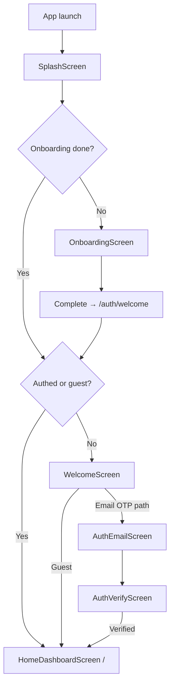
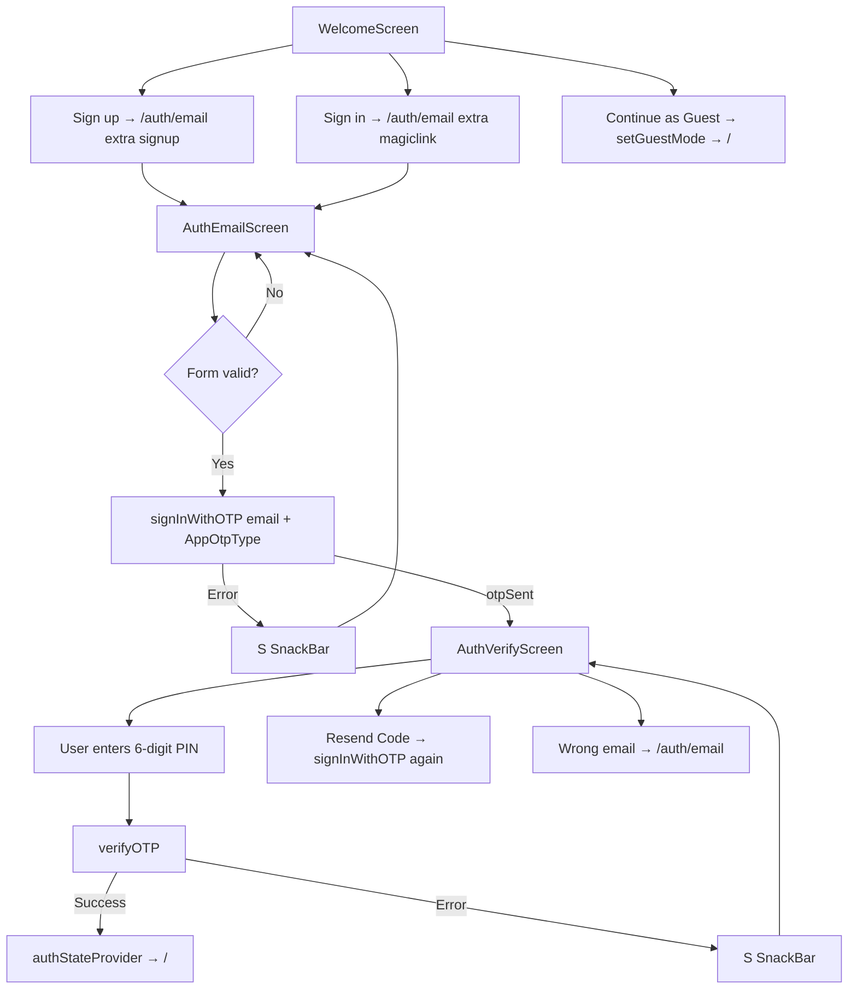
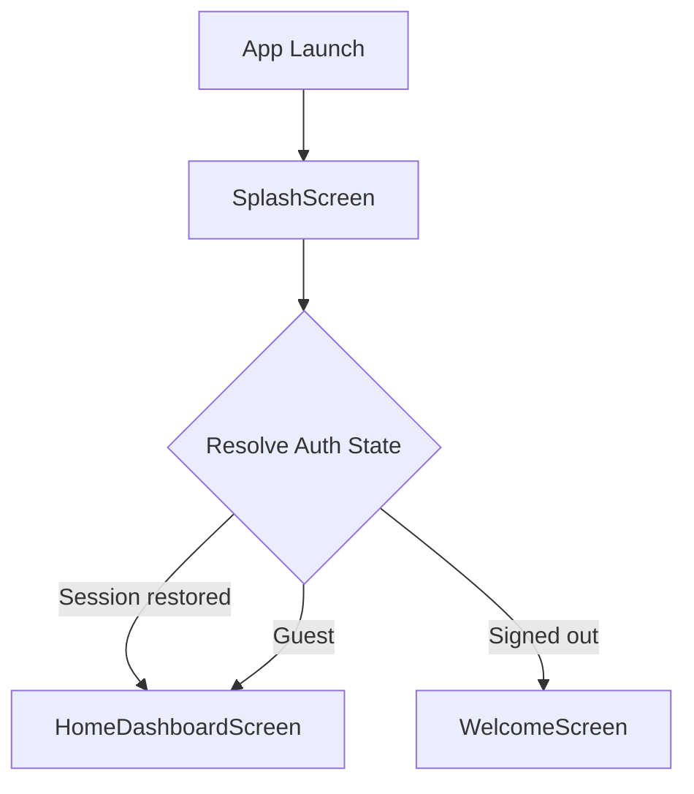
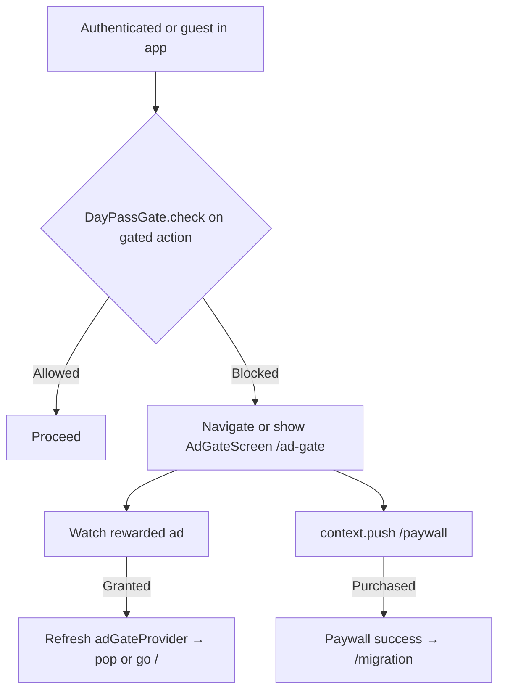
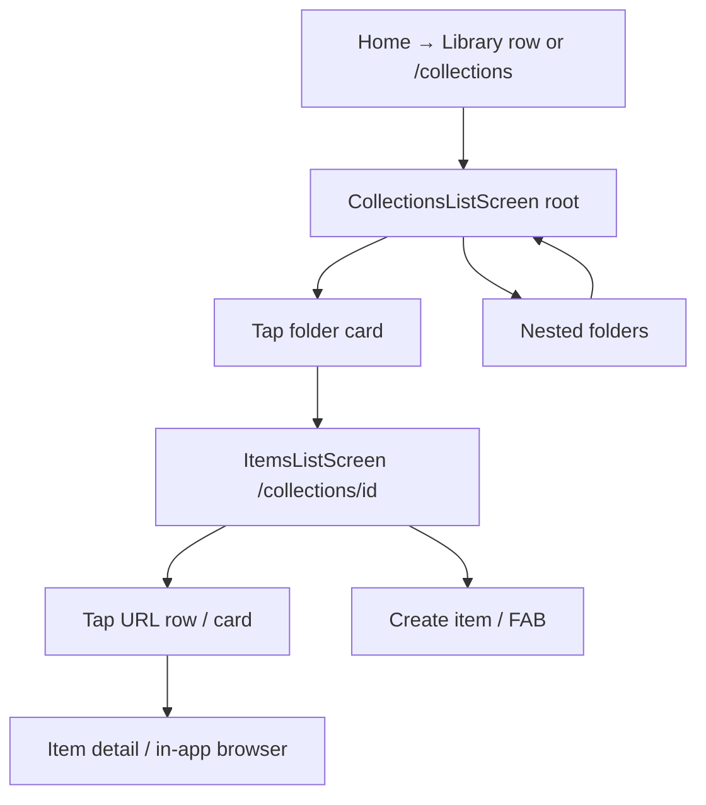
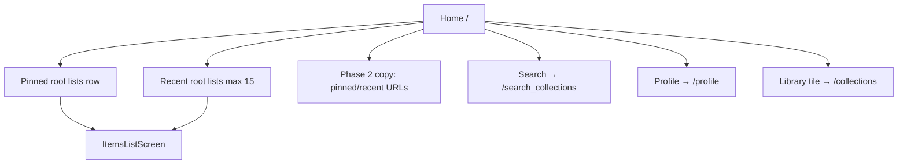
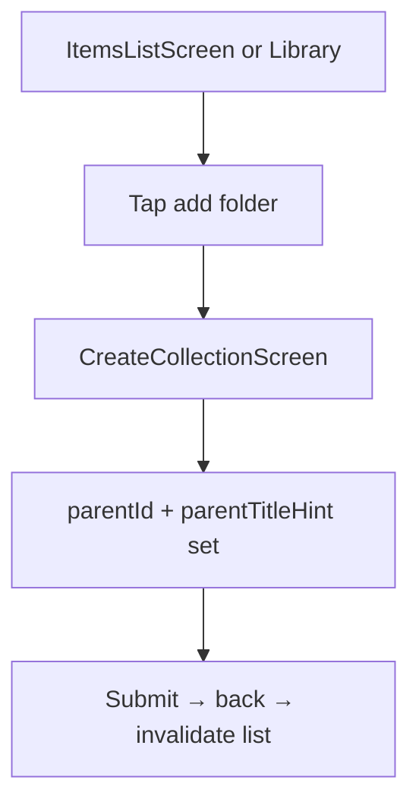

# LinkVault — UI/UX Flow Document

**Version:** 1.1  
**Last Updated:** 2026-03-25  
**Owner:** Product & Design  
**Status:** Active — aligned with `lib/core/router/app_router.dart` and primary screens  
**Related:** [Home_Collections_Visual_Contract.md](./Home_Collections_Visual_Contract.md) | [Home_and_Collections_UX_Architecture.md](../03_ARCHITECTURE/Home_and_Collections_UX_Architecture.md) | [ADR_0003](../10_DECISIONS_AND_RISKS/ADR_0003_Home_Landing_and_Folder_Content_Model.md) | [PRD v1.2](../01_PRODUCT/Product_Requirements_Document.md)

**Reference style:** This document follows the depth and structure of `curate/docs/02_DESIGN/UI_UX_Flow_Document.md` (wireframe blocks, route tables, mermaid flows). **Curate is not authoritative** for LinkVault product behavior; use canonical `docs/` links above.

---

## Changelog

| Version | Date       | Changes |
| ------- | ---------- | ------- |
| 1.1     | 2026-03-25 | `/` → `HomeDashboardScreen`; single route table; deep Splash / Onboarding / Welcome / Email OTP / Verify / Ad gate / Paywall wireframes and flows (Curate-level depth). |
| 1.0     | 2026-03-24 | Initial LinkVault flows: design system summary, route map (current + target), Home/Library/URLs wireframes, unified hub target, interaction patterns. |

---

## Document Purpose

End-to-end **UI/UX flows and ASCII wireframes** for LinkVault: **cold start**, **onboarding**, **email OTP authentication**, **day pass / ad gate**, **premium paywall**, **Home dashboard** (`/`), **Library** (`/collections`), **nested collections**, and **URL (item) lists**.

**Design philosophy (LinkVault reboot):**

- **Resume-first:** Home highlights pinned and recent **root** lists; Library holds the full root grid/list.  
- **Clear scope:** Home = quick resume; Library = browse all root folders.  
- **Nested collections:** Repeating list/grid pattern for child folders; URLs open from `ItemsListScreen`.  
- **Mobile-first:** One-handed use, thumb reach for FAB and primary actions.  
- **Visual continuity:** Reuse collection cards, rounded 20–24px containers, and theme tokens from the running app.

---

## Table of Contents

1. [Design system](#1-design-system)  
2. [Route map](#2-route-map)  
3. [User flow maps](#3-user-flow-maps)  
4. [Screen-by-screen wireframes](#4-screen-by-screen-wireframes)  
5. [Interaction patterns](#5-interaction-patterns)  
6. [Animation and transitions](#6-animation-and-transitions)  
7. [Responsive notes](#7-responsive-notes)  
8. [Related documents](#related-documents)

---

## 1. Design System

Detailed spacing and section rules: [Home_Collections_Visual_Contract.md](./Home_Collections_Visual_Contract.md). Below is a **summary** for wireframe readers.

### 1.1 Color and theme

- **Framework:** Material 3 `ColorScheme` (light/dark). Primary accent from app theme (see `lib/core/theme/`).  
- **Collection cards:** User-selected `color_hex` with optional “no cover” neutral treatment (`AppColors` helpers).  
- **Semantic:** `error` for destructive actions; `onSurfaceVariant` for subtitles and section hints.

### 1.2 Typography (logical roles)

| Role | Typical style |
|------|----------------|
| Screen / app bar title | `titleLarge` or `titleMedium`, bold |
| Section header (Home) | `titleMedium` semibold |
| Card title | `titleSmall` / `bodyLarge` semibold |
| Metadata / counts | `bodySmall`, `onSurfaceVariant` |
| Buttons | `labelLarge` |

### 1.3 Spacing (8pt grid)

| Token | Value | Use |
|-------|-------|-----|
| Page horizontal padding | 16 | Scroll content edge |
| Card inner padding | 20 × 16 | Form rows, collection-style blocks |
| Section gap | 24 | Between major Home blocks |
| Card gap (grid) | 16 | Between collection tiles |

### 1.4 Radius and elevation

- **Cards / form blocks:** 20–24px corner radius.  
- **FAB:** Circular or stadium per theme; standard M3 elevation.  
- **Sheets:** 20px top corners (modal bottom sheets).

### 1.5 Iconography

- **Collections:** Emoji or icon in circle (existing `CollectionCard` / `CollectionListTile`).  
- **System:** Material Symbols for app bar, overflow, pin, archive, add.

---

## 2. Route map

Navigation uses **GoRouter** (`lib/core/router/app_router.dart`). Redirects cover onboarding, auth, and guest mode.

### 2.1 Route table (implemented)

| Route | Screen | Auth / guest | Notes |
|-------|--------|--------------|--------|
| `/splash` | `SplashScreen` | No | Session resolution; min display time; sets install date for trial |
| `/onboarding` | `OnboardingScreen` | No | Until `hasSeenOnboarding` |
| `/auth/welcome` | `WelcomeScreen` | No | Sign up / Sign in / Guest |
| `/auth/email` | `AuthEmailScreen` | No | `extra`: `AppOtpType` (`signup` \| `magiclink`) |
| `/auth/verify` | `AuthVerifyScreen` | No | `extra`: `AuthVerifyScreenParams` (email + type); missing params → fallback email screen |
| `/paywall` | `PaywallScreen` | Open | RevenueCat; success → `/migration` |
| `/ad-gate` | `AdGateScreen` | Open | Rewarded ad or premium |
| `/migration` | `MigrationScreen` | Open | Post-purchase sync |
| `/daypass` | `DayPassScreen` | Varies | Day-pass management |
| **`/`** | **`HomeDashboardScreen`** | Yes or guest | Pinned + recent root lists; Library row; search / profile |
| `/search` | Placeholder | Yes | To be replaced |
| `/activity` | Placeholder | Yes | Shown in dev app bar only when `AppConfig.isDev` |
| `/search_collections` | `SearchCollectionsScreen` | Yes | Collection search |
| `/profile` | `ProfileScreen` (+ `edit`, `legal`, `debug`) | Yes | Settings shell |
| `/collections` | `CollectionsListScreen` | Yes | **Library** — root folders (`parent_id == null`), same data filters as Home lists |
| `/collections/create` | `CreateCollectionScreen` | Yes | Query `parent`, optional `extra: Collection` |
| `/collections/:id` | `ItemsListScreen` | Yes | URLs for collection |
| `/collections/:id/edit` | `EditCollectionScreen` | Yes | Metadata + items |
| `/collections/:id/items/*` | Create / detail / edit item | Yes | Item flows |

**Open routes** (no redirect to auth): `/paywall`, `/ad-gate`, `/migration`. Splash is always allowed before onboarding check.

### 2.2 Navigation guard (simplified)

```
1. Location is /splash → allow
2. Location is in open routes → allow
3. Onboarding not completed → /onboarding
4. Auth loading → stay (null)
5. No user and not guest → /auth/welcome
6. Has access and on /onboarding → /
7. Authenticated on /auth/welcome (or /login-callback) → /
8. Else allow
```

Guest users may use auth routes and protected routes; **DayPass** is enforced in context via `DayPassGate.check()` on sensitive actions.

---

## 3. User flow maps

### 3.1 Cold start → first useful screen



### 3.2 Email OTP authentication



**`AppOtpType`:** `signup` (new account path) and `magiclink` (returning sign-in). Both use Supabase OTP; copy on the email screen explains Curate → LinkVault email continuity.

### 3.3 Returning user — session restore



### 3.4 Day pass, ad gate, and limited access



Copy and buttons on `AdGateScreen` match implementation (“Daily Access Required”, “Watch Ad – Get Daily Access”, “Go Premium – No Ads Forever”).

### 3.5 Premium conversion (RevenueCat)

```mermaid
graph TD
    A[Free or guest user] --> B{Trigger}
    B -->|Ad gate| C[/ad-gate]
    B -->|Profile / upgrade CTA| D[/paywall]
    B -->|Feature gate| D

    D --> E[PaywallScreen]
    E --> F[Load offerings via PaywallViewModel]
    F -->|Error| G[Inline error or SnackBar]
    F -->|Packages| H[Annual / Monthly cards]
    H --> I[purchasePackage]
    H --> J[restorePurchases]
    I -->|Success| K[PaywallStatus.success]
    K --> L[context.go /migration]
    I -->|Cancelled| M[Silent]
    J --> N[SnackBar if none found]
```

### 3.6 Browse: Library → folder → URLs (current model)



> **Note:** Opening a folder from Library typically goes to **`ItemsListScreen`**. Nested **child** folders depend on list composition and parent context; see architecture doc for hub / Phase 3.

### 3.7 Home dashboard (implemented)



### 3.8 Create nested folder



---

## 4. Screen-by-screen wireframes

### 4.1 Splash Screen (`/splash`)

```
┌─────────────────────────────────────┐
│                                     │
│                                     │
│         [App logo asset]            │
│                                     │
│            LinkVault                │
│                                     │
│         [Loading indicator]         │
│                                     │
│                                     │
└─────────────────────────────────────┘
```

**Behaviour:**

- Minimum display delay (~1.5s) for brand continuity.  
- `AppSettingsRepository.setInstallDateIfNotSet()` once (DayPass trial anchor).  
- Waits for `authStateProvider` to finish loading when needed.  
- Navigates with `context.go('/')` — **GoRouter redirect** decides onboarding, welcome, or Home.

---

### 4.2 Onboarding (`/onboarding`)

**Implemented as a single `OnboardingScreen` with `PageView` and skip.**

```
┌─────────────────────────────────────┐
│                        Skip         │
│                                     │
│      [Full-screen illustration]     │
│                                     │
│            {Title}                  │
│         {Description}               │
│                                     │
│           ● ○ ○                     │
│                                     │
│     ┌─────────────────────────┐    │
│     │       Next / Get Started │    │
│     └─────────────────────────┘    │
│                                     │
└─────────────────────────────────────┘
```

**Slides (3 total)** — from `OnboardingNotifier` / `AppAssets`:

| # | Title | Description | Image asset |
|---|--------|-------------|-------------|
| 1 | Save Links | Capture any URL in seconds so it never gets lost. | `onboarding_save` |
| 2 | Organize | Put links into collections and keep everything tidy. | `onboarding_organize` |
| 3 | Sync Anywhere | Ready on every device (cloud sync coming in later sprints). | `onboarding_act` |

**Interactions:**

- Swipe between pages or use **Next**; last page completes flow.  
- **Skip** (top-right) calls the same completion path as finishing the last slide.  
- On complete: `CompleteOnboardingUseCase` → `hasSeenOnboarding = true` → `context.go('/auth/welcome')`.  
- Page indicator dots reflect `currentPage`.

**State:** `onboardingProvider` (`OnboardingNotifier`).

---

### 4.3 Welcome Screen (`/auth/welcome`)

```
┌─────────────────────────────────────┐
│                                     │
│         [Collections bookmark icon]│
│                                     │
│            LinkVault                │
│   Save links. Organize collections. │
│                                     │
│     ┌─────────────────────────┐    │
│     │        Sign up          │    │
│     └─────────────────────────┘    │
│                                     │
│     ┌─────────────────────────┐    │
│     │        Sign in          │    │
│     └─────────────────────────┘    │
│                                     │
│       Continue as Guest →           │
│                                     │
│     [Loading indicator if busy]     │
│                                     │
└─────────────────────────────────────┘
```

**Interactions:**

- **Sign up** → `context.push('/auth/email', extra: AppOtpType.signup)`.  
- **Sign in** → `context.push('/auth/email', extra: AppOtpType.magiclink)`.  
- **Continue as Guest** → `authNotifier.continueAsGuest()` → `context.go('/')`.  
- Authenticated users hitting welcome are redirected to `/` by the router guard.

---

### 4.4 Auth — Email (`/auth/email`)

**Single screen; title and body copy depend on `AppOtpType`.**

```
┌─────────────────────────────────────┐
│  ←   Create Account    (or Sign In) │
├─────────────────────────────────────┤
│  {Intro paragraph per mode}         │
│  {Curate migration hint paragraph}  │
│                                     │
│  Email                              │
│  ┌─────────────────────────────┐   │
│  │  you@email.com          ✉   │   │
│  └─────────────────────────────┘   │
│                                     │
│     ┌─────────────────────────┐    │
│     │        Continue         │    │
│     └─────────────────────────┘    │
│                                     │
│  Toggle: Already have account? /    │
│          Don't have account?        │
│                                     │
│  {Privacy / local data footnote}    │
│                                     │
└─────────────────────────────────────┘
```

**Validation (client-side):**

| Rule | Message |
|------|---------|
| Empty | Email is required |
| Format | Enter a valid email address (regex on `AuthEmailScreen`) |

**States:**

| State | UI |
|-------|-----|
| Idle | Form enabled |
| Loading | Continue shows small `CircularProgressIndicator`; button disabled |
| Error | SnackBar (error color); `clearError` on notifier after show |

**Success path:** `otpSent` → `context.go('/auth/verify', extra: AuthVerifyScreenParams)`.

**Provider:** `authNotifierProvider` + `authStateProvider` listener (if session appears early → `context.go('/')`).

---

### 4.5 Auth — Verify OTP (`/auth/verify`)

```
┌─────────────────────────────────────┐
│  ←        Verify Code               │
├─────────────────────────────────────┤
│                                     │
│         [Mail read icon]            │
│                                     │
│  Enter the 6-digit code sent to:    │
│         user@email.com              │
│  {First-login profile setup hint}   │
│                                     │
│   ┌─┐ ┌─┐ ┌─┐ ┌─┐ ┌─┐ ┌─┐          │
│   │ │ │ │ │ │ │ │ │ │ │ │          │
│   └─┘ └─┘ └─┘ └─┘ └─┘ └─┘          │
│        (Pinput — length 6)          │
│                                     │
│        [Resend Code]                │
│        Wrong email? Change it       │
│                                     │
└─────────────────────────────────────┘
```

**Interactions:**

- **Pinput** `onCompleted` → `verifyOTP(email, otp, type)`.  
- **Resend Code** → `signInWithOTP` again; SnackBar “A new code has been sent” on success.  
- **Wrong email?** → `context.go('/auth/email', extra: type)`.  
- **Back** → pop to previous route.

**Success:** `authStateProvider` emits non-guest user → if verification started in guest mode, route to `context.go('/migration')`; otherwise `context.go('/')`.

**Edge case:** Direct navigation without `extra` shows `AuthEmailScreen` fallback (e.g. web refresh).

---

### 4.6 Home dashboard (`/` — `HomeDashboardScreen`)

**Implemented.** Layout aligns with [Home_Collections_Visual_Contract.md](./Home_Collections_Visual_Contract.md) and ADR-0003 (pinned + recent root lists; Library entry).

```
┌─────────────────────────────────────┐
│  👤   LinkVault          🔍   (🔔)  │
├─────────────────────────────────────┤
│  Pinned lists            See all →  │
│  ┌────┐ ┌────┐ ┌────┐  horizontal   │
│  │ 📌 │ │ 📌 │ │ 📌 │  scroll      │
│  └────┘ └────┘ └────┘              │
│                                     │
│  Recent lists                       │
│  ┌─────────────────────────────┐   │
│  │ 🍽️  Weekend ideas      ›   │   │
│  └─────────────────────────────┘   │
│  (max 15 non-pinned by recency)    │
│                                     │
│  {Muted: Pinned/recent URLs phase2} │
│                                     │
│  ┌─────────────────────────────┐   │
│  │ 📂  Library — All folders  › │   │
│  └─────────────────────────────┘   │
│                                     │
│                              [+]    │
└─────────────────────────────────────┘
```

**Data rules (code):**

- **Root scope:** `parentId == null`, not deleted, not archived.  
- **Pinned row:** `isPinned`; sort by `position` then title; horizontal chips ~128px wide.  
- **Recent:** excludes pinned; sort by `lastAccessedAt ?? updatedAt` descending; cap **15**.  
- **Empty global collections:** empty-state column with **New list** + **Open Library**.

**Behaviours:**

- **See all** (pinned header) → `/collections`.  
- **Library row** → `/collections`.  
- **Search** → `/search_collections`.  
- **Profile avatar** → `/profile`.  
- **FAB** → `/collections/create` after `DayPassGate.check`.  
- **Tap list** → `/collections/:id` with `extra: title` after day-pass check.  
- **Long-press recent row** → `/collections/:id/edit` after day-pass check.

**Dev-only:** Activity icon in app bar when `AppConfig.isDev`.

---

### 4.7 Library — root collections (`/collections`)

**`CollectionsListScreen`** — app bar title **“Library”** (not “Home”). Same root filtering as Home (non-deleted, non-archived, `parentId == null`). Tabs / grid toggle match existing implementation.

```
┌─────────────────────────────────────┐
│  👤   Library            🔍   ⋮    │
├─────────────────────────────────────┤
│  [ Dev: Recent | Private | Shared ] │
│  [ Grid / list toggle ]             │
├─────────────────────────────────────┤
│  ┌──────────┐  ┌──────────┐        │
│  │  🍽️      │  │  📚      │        │
│  │ Weekend  │  │ Reading  │        │
│  └──────────┘  └──────────┘        │
│                                     │
│                              [+]    │
└─────────────────────────────────────┘
```

---

### 4.8 Nested folder list (scoped `parent_id`)

Visually aligned with Library but **back** + **context title**; optional breadcrumb in architecture doc.

```
┌─────────────────────────────────────┐
│  ←  Travel                    ⋮     │
│      2 folders · 8 links            │
├─────────────────────────────────────┤
│  ┌──────────┐  ┌──────────┐        │
│  │ Europe   │  │ Asia     │        │
│  └──────────┘  └──────────┘        │
└─────────────────────────────────────┘
```

---

### 4.9 Unified folder hub (target — Phase 3, ADR-0003)

Two-tab hub:

- **Folders** tab shows child folders only (same tiles as Library/folder list).
- **Links** tab shows URLs only (the URL list for this folder scope).

Not implemented as a dedicated screen yet.

```
┌─────────────────────────────────────┐
│  ←  Travel                    ⋮     │
├─────────────────────────────────────┤
│  [ Folders ]      [ Links ]        │
├─────────────────────────────────────┤
│  (Tab: Folders)                     │
│  ┌──────────┐  ┌──────────┐       │
│  │  Europe  │  │   Asia   │       │
│  └──────────┘  └──────────┘       │
│                                     │
│  (Tap Links)                        │
│                                     │
│  (Tab: Links)                       │
│  ┌─────────────────────────────┐  │
│  │ 🔗  Example.com             ›  │  │
│  └─────────────────────────────┘  │
│                                     │
│                              [+]    │
└─────────────────────────────────────┘
```

---

### 4.10 Items list — URLs (`ItemsListScreen`)

```
┌─────────────────────────────────────┐
│  ←  Reading list      📁+   ⋮      │
├─────────────────────────────────────┤
│  [ Filter chips: All · Unread · … ] │
├─────────────────────────────────────┤
│  ┌──────────┐  ┌──────────┐        │
│  │ [thumb]  │  │ [thumb]  │        │
│  │ Title A  │  │ Title B  │        │
│  └──────────┘  └──────────┘        │
│                              [+]    │
└─────────────────────────────────────┘
```

**Side effect:** `recordCollectionAccess(collectionId)` on open where implemented.

---

### 4.11 Create list (`CreateCollectionScreen`)

Aligned with **New list** flow: title, category/emoji, description, display defaults, parent, optional dev Shared toggle.

---

### 4.12 Edit list (`EditCollectionScreen`)

Header **Edit list**; form + items list with infinite scroll; overflow **Delete**, etc.

---

### 4.13 Search collections (`SearchCollectionsScreen`)

```
┌─────────────────────────────────────┐
│  ←  Search lists                    │
├─────────────────────────────────────┤
│  ┌─────────────────────────────┐   │
│  │ 🔍  Search…                  │   │
│  └─────────────────────────────┘   │
├─────────────────────────────────────┤
│  Results…                           │
└─────────────────────────────────────┘
```

---

### 4.14 Ad Gate Screen (`/ad-gate`)

```
┌─────────────────────────────────────┐
│                                     │
│         [Ticket / badge icon]       │
│                                     │
│      Daily Access Required          │
│                                     │
│  Your free trial has ended. Watch   │
│  a short ad each day to keep full   │
│  access to LinkVault, or upgrade.   │
│                                     │
│  ┌─────────────────────────────┐   │
│  │ ▶ Watch Ad – Get Daily Access│   │
│  └─────────────────────────────┘   │
│  ┌─────────────────────────────┐   │
│  │ Go Premium – No Ads Forever │   │
│  └─────────────────────────────┘   │
│                                     │
│  {Grace period banner if offline}   │
│                                     │
└─────────────────────────────────────┘
```

**Behaviour:**

- `adGateProvider` drives status; when no longer `expired`, `context.go('/')`.  
- **Watch ad** → `watchAdForAccess()` (rewarded flow).  
- **Go Premium** → `context.push<bool>('/paywall')` then refresh gate.  
- **Grace:** tertiary banner when status is `grace` (offline / ad unavailable).

---

### 4.15 Premium Paywall (`/paywall`)

Offerings and prices come from **RevenueCat** (`PaywallViewModel`); cards are not hardcoded.

```
┌─────────────────────────────────────┐
│                              ✕      │
│  [Custom premium background / hero] │
│                                     │
│     LINKVAULT (small caps label)     │
│     Your links, without limits.      │
│                                     │
├─────────────────────────────────────┤
│  {Feature bullet list from UI}      │
├─────────────────────────────────────┤
│  ┌─────────────────────────────┐   │
│  │  Annual Plan · badge        │   │
│  │  {RC price}    [Subscribe]  │   │
│  └─────────────────────────────┘   │
│  ┌─────────────────────────────┐   │
│  │  Monthly · {RC price}       │   │
│  └─────────────────────────────┘   │
│         Restore purchases           │
│  {Subscription legal copy}           │
└─────────────────────────────────────┘
```

**States:**

| State | UI |
|-------|-----|
| Loading | Center progress (theme accent) |
| Offerings ready | Package cards + hero |
| Error | Center message; offerings null |
| Purchasing | Full-screen dim + progress overlay |
| Success | SnackBar + `context.go('/migration')` |
| Cancelled | No SnackBar (purchase cancelled) |

**Opening from code:**

```dart
final upgraded = await context.push<bool>('/paywall');
```

---

### 4.16 Profile / settings (`/profile`)

List-driven shell: account, upgrade, legal, sign out, debug (if enabled). Match `ProfileScreen` implementation.

---

## 5. Interaction patterns

### 5.1 Gestures (summary)

| Gesture | Context | Action |
|---------|---------|--------|
| Tap | Collection card / row | Navigate to items or folder |
| Tap | FAB | Create collection or item (after day-pass check) |
| Long-press | Collection in Library | Bottom sheet: Edit, Pin, Archive, Delete |
| Long-press | Recent row on Home | Jump to edit collection (after day-pass check) |
| Pull | Lists | Refresh / invalidate providers |
| Swipe | Onboarding | Change slide |

### 5.2 Navigation patterns

| Pattern | Behaviour |
|---------|-----------|
| Deep link `/collections/:id` | Items list for that id |
| After purchase | Paywall → `/migration` (sync UX) |
| Guest | Can reach Home and Library; cloud-gated features use repositories per ADR-0002 |

### 5.3 Feedback

| Mechanism | Use |
|-----------|-----|
| SnackBar | Auth errors, paywall restore, resend OTP |
| Inline validation | Email field |
| Loading | Buttons, full-screen overlays on paywall purchase |
| Empty states | `EmptyStateView` with asset + CTA |

---

## 6. Animation and transitions

- **Page:** Default M3 transitions via GoRouter.  
- **Onboarding:** `PageView` 300ms curve for Next.  
- **Paywall:** Fade-in hero (`AnimationController` ~1.2s).  
- **Sheets:** Modal bottom sheet standard M3 motion.  
- **Home:** Optional staggered sections (future polish).

---

## 7. Responsive notes

- **Phone:** Home pinned row horizontal scroll; Library grid **2 columns** default.  
- **Tablet / foldable:** Grid **3 columns**; optional two-pane hub later.  
- **Landscape:** Keep app bar + scroll; avoid more than 3 narrow grid columns.

---

## Related documents

| Document | Role |
|----------|------|
| [Home_Collections_Visual_Contract.md](./Home_Collections_Visual_Contract.md) | Spacing, headers, row types |
| [Home_and_Collections_UX_Architecture.md](../03_ARCHITECTURE/Home_and_Collections_UX_Architecture.md) | IA, data signals, phases |
| [ADR_0003](../10_DECISIONS_AND_RISKS/ADR_0003_Home_Landing_and_Folder_Content_Model.md) | Landing route, caps, hub target |
| [Product_Requirements_Document.md](../01_PRODUCT/Product_Requirements_Document.md) | Functional requirements |

---

## Revision history

| Version | Date | Notes |
|---------|------|--------|
| 1.1 | 2026-03-25 | Home at `/`; Curate-depth auth, onboarding, ad gate, paywall; single route table. |
| 1.0 | 2026-03-24 | Initial LinkVault UI/UX flow doc. |
