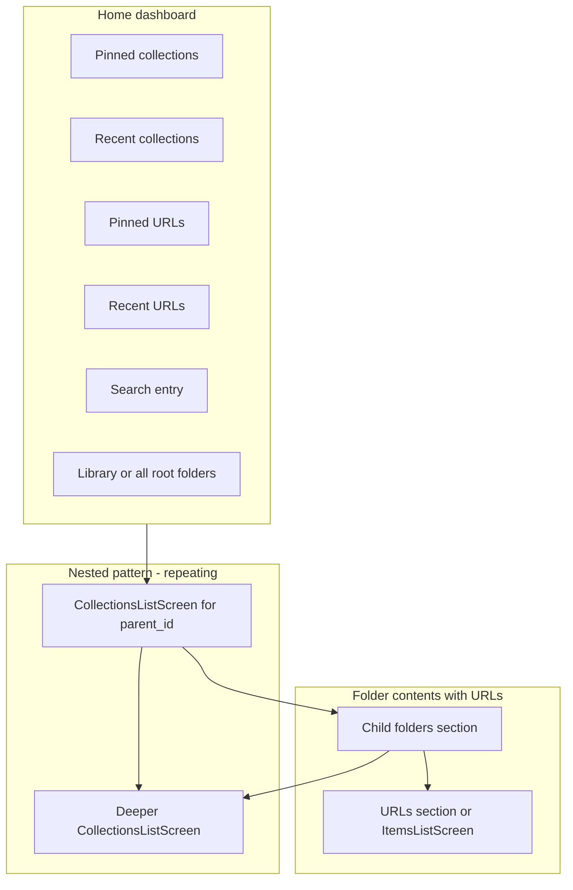

# LinkVault — Home and Collections UX Architecture

Version: 1.2  
Last Updated: 2026-03-25  
Status: Active  
Owner: Product + Engineering  
Depends On: [Technical_Architecture.md](./Technical_Architecture.md), [Developer_Bible.md](./Developer_Bible.md), [Unified_Collections_Items_Root_Architecture.md](./Unified_Collections_Items_Root_Architecture.md), [Collections extended schema (Sprint 5–6)](../09_SPRINT_ARCHITECTURE/SPRINT_5_6_COLLECTIONS/Collections_Extended_Schema_and_UX_Fields.md), [Supabase_Schema_and_Migrations.md](../04_DATA_AND_MIGRATION/Supabase_Schema_and_Migrations.md), [ADR_0003](../10_DECISIONS_AND_RISKS/ADR_0003_Home_Landing_and_Folder_Content_Model.md)  
Blocks: Home pinned/recent **URLs**, unified folder hub, shell navigation polish

---

## Purpose

Define the **app-level information architecture** and **UX contract** for:

- A **dedicated Home** surface (dashboard) that highlights **pinned** and **recent** collections and URLs, plus entry points to search and library scope.
- A **repeatable nested pattern** for **folder hierarchy** using the existing **collections list** paradigm (`CollectionsListScreen` and equivalents).
- A clear model for showing **child collections** and **URLs** together inside a single parent folder without confusing scope or navigation.

This document is the canonical UX/architecture reference for navigation and primary screens. It does **not** replace visual design specs in `docs/02_DESIGN/`; it constrains **flows**, **screen roles**, and **data dependencies**.

---

## Design goals

1. **Obvious home** — After auth, users land on a surface that answers: “What should I open next?” (resume work), not “Here is the whole tree.”
2. **Stable hierarchy** — Drilling into folders uses one familiar pattern (list/grid of child folders → deeper level). Back stack mirrors the tree.
3. **Metadata-driven surfacing** — Pinned and recent rows are **derived** from explicit fields and events (no duplicate “favorite” concepts unless product requires it).
4. **Scoped vs global** — Home is **global**. Inside a folder, actions and lists are **scoped** to `collection_id` (and descendants only when explicitly designed, e.g. search).
5. **Reboot UX** — `lib_old` may inform **what** to rank (e.g. `last_accessed_at`); it does **not** dictate **layout** or **navigation** of the new app.
6. **Alignment with persistence** — Local-first and Supabase stay authoritative; home sections must tolerate **stale** or **loading** cloud data (see [Data_Persistence_State_Machine.md](../04_DATA_AND_MIGRATION/Data_Persistence_State_Machine.md)).

---

## Mental model: Home vs nested scope

| Concept | Role | Primary user question |
|--------|------|------------------------|
| **Home** | Global dashboard + shortcuts | “What’s important or recent across my library?” |
| **Folder scope** (`CollectionsListScreen` at `parent_id = X` or root) | Tree navigation | “What folders are inside this place?” |
| **Folder contents** (collections + URLs) | Mixed content for one parent | “What’s in this folder—subfolders and links?” |

**Root vs Home:** Today, authenticated users may land on `/` (see router). Architecturally, **`/` should become (or host) the Home dashboard**, while **“all root-level folders”** can be a section on Home or a dedicated “Library” sub-route (product choice). Avoid using the same screen for both **global recents** and **root folder listing** without clear sectioning—that blurs scope.

---

## Target information architecture

---

## Screen catalog (target state)

| Screen / route | Responsibility | Data scope |
|----------------|----------------|------------|
| **Home** (new or evolved `/`) | Pinned/recent collections & URLs; optional stats; CTA to create; entry to search | User’s collections + URLs (aggregated queries) |
| **CollectionsListScreen** | Lists **child collections** for a given `parent_id` (null = root). Layout respects `child_collections_layout` when implemented. | `lv_collections` filtered by `parent_id`, `owner_id`, soft-delete rules |
| **Folder hub** (optional composite) | Single scroll or tabbed UI: **Folders** + **Links** for the **same** `collection_id` | Children collections + `lv_urls` for `collection_id` |
| **ItemsListScreen** (current) | Lists **items/URLs** for one collection | `lv_urls` for `collection_id` |
| **Search** (existing) | Global or scoped search | As per search feature design |
| **Create / Edit collection** | Metadata including layouts, pin, archive | Single collection |

**Note:** Today **ItemsListScreen** is a separate route from **CollectionsListScreen**. The architecture allows either:

- **A)** Keep **URLs** on `ItemsListScreen` and show **only folders** on `CollectionsListScreen` at the same level (user taps folder → children list; taps “open links” → items screen), or  
- **B)** Introduce a **unified folder screen** that composes both sections and optionally deep-links to the same URL list for focus.

Product should pick **A vs B** for v1; the doc recommends **B** long-term for fewer context switches when a folder has both subfolders and links.

---

## Home: recommended sections

Sections are **ordered** for scanability; exact order is adjustable with design.

1. **Pinned collections** — `is_pinned == true`, not archived/deleted, sort by `position` then `updated_at`.
2. **Recent collections** — Sort by `last_accessed_at` descending (nulls last), cap N (e.g. 10–15). Requires reliable `recordCollectionAccess` (or equivalent) on open.
3. **Pinned URLs** — From `lv_urls`: `is_pinned == true`, same collection visibility rules, cap N.
4. **Recent URLs** — Sort by `last_accessed_at` or `updated_at`, cap N. May dedupe by URL or domain if product wants.
5. **Search** — Prominent field or button to existing search route.
6. **Library** — “All folders” / root `CollectionsListScreen` or compact grid of root collections.

**Empty states:** Each section should collapse or show a single friendly empty hint (no huge blank home).

**Performance:** Prefer **one** underlying stream/cache per entity type where possible; **derive** sections in the presentation layer to avoid conflicting sources of truth.

---

## Nested folders + URLs in one place

**Problem:** A folder may contain both **child collections** and **URLs**. Users should not guess whether content is “above” or “below” in the information architecture.

**Recommended patterns (industry-aligned):**

| Pattern | Pros | Cons |
|---------|------|------|
| **Single scroll, two groups** (“Folders” then “Links”) | Clear mental model; matches Files + note attachments | Long scroll; needs clear headers |
| **Segmented control** (Folders | Links) | Focused view; less scroll | Extra tap to see half the content |
| **Folders first, links collapsed** (“Show N links”) | Good when folders dominate | Links discoverability |

**Schema alignment:**

- `child_collections_layout` — layout for **child folder tiles** in that parent context.
- `items_layout` — default for **URL list** (or grid) in that parent context.

Rendering should **read these fields** when building the folder hub or items screen (implementation backlog).

---

## Pinned and recent: rules of engagement

### Collections

- **Pinned:** `is_pinned` on `lv_collections`; surfaced on Home and optionally a persistent “Pinned” strip in nested views (optional).
- **Recent:** `last_accessed_at` updated when the user **opens** the collection’s item list or **opens the collection for edit**, per [Collections_Extended_Schema_and_UX_Fields.md](../09_SPRINT_ARCHITECTURE/SPRINT_5_6_COLLECTIONS/Collections_Extended_Schema_and_UX_Fields.md). Avoid double-counting if both fire in one flow (optional debounce or single hook).

### URLs

- **Pinned:** `is_pinned` on `lv_urls` (see migrations for `lv_urls`).
- **Recent:** Prefer **`last_accessed_at`** on the URL row when the user opens the link; align with analytics if needed.

**Home queries** may need **server-side** or **client-side** aggregation:

- Short term: client filters on `watchCollections()` + paginated URL query per collection (simple but costly).
- Medium term: Supabase **RPC** or **materialized view** for “recent URLs across library” (one round-trip).

Document the chosen approach in an ADR when RPC/views are introduced.

---

## Navigation map (aligned with router)

**Implemented (see `lib/core/router/app_router.dart`):**

- `/` — **`HomeDashboardScreen`** — pinned + recent root lists; entry to Library and search.
- `/collections` — **Root** `CollectionsListScreen` (`parent_id == null`).
- `/collections/create`, `/collections/:id/edit`, `/collections/:id` → `ItemsListScreen`, item routes, etc.

**Future (Phase 3 / ADR-0003):**

- `/collections/:id` — Optional **folder hub** (folders + links in one scroll) vs current split with `ItemsListScreen`.

Exact paths should stay consistent with `app_router.dart`; update this section when routes change.

---

## Engineering constraints

- **Use cases:** [Developer_Bible.md](./Developer_Bible.md) requires mutations through use cases. New home actions (pin, open, record access) should follow the same pattern over time; existing direct repository reads for navigation metadata should be wrapped incrementally.
- **State:** Prefer Riverpod **derived** providers for “pinned collections,” “recent collections,” etc., from a single source stream per repository contract.
- **Offline:** Home sections degrade gracefully when cloud data is unavailable but ObjectBox has data (per tier/state machine).

---

## Relation to legacy (`lib_old`)

Legacy code (e.g. `lib_old/src/app_home/`, dashboard-style URL lists, `lastAccessedAt` on collections/URLs) validates that **recency and pins** mattered in the old product. The new Home should **preserve those signals** in data and **reinvent** presentation and navigation. Do not copy legacy screen structure as a requirement.

---

## Phased rollout (suggested)

1. **Phase 1 — Home MVP** — New home route with pinned + recent **collections** only; link to root `CollectionsListScreen` and search.
2. **Phase 2 — URLs on Home** — Pinned + recent **URLs** with a defined query strategy.
3. **Phase 3 — Folder hub** — Unified folder screen or enhanced `ItemsListScreen` with child folders + links respecting layout preferences.
4. **Phase 4 — Polish** — Widgets, animations, adaptive layout, deep links from notifications.

---

## Resolved decisions

Product and engineering decisions for the former “open questions” are **Approved** in [ADR_0003: Home Landing and Folder Content Model](../10_DECISIONS_AND_RISKS/ADR_0003_Home_Landing_and_Folder_Content_Model.md) (landing route, folder hub target vs interim split, recent caps, pinned URL surfacing). PRD **v1.2** reflects requirements deltas.

---

## Related documents

- [ADR_0003](../10_DECISIONS_AND_RISKS/ADR_0003_Home_Landing_and_Folder_Content_Model.md) — binding decisions for landing and folder model.
- [Home_Collections_Visual_Contract.md](../02_DESIGN/Home_Collections_Visual_Contract.md) — visual-only contract; flow remains in this doc.
- [UI_UX_Flow_Document.md](../02_DESIGN/UI_UX_Flow_Document.md) — Curate-style wireframes and route flows for LinkVault.
- [Technical_Architecture.md](./Technical_Architecture.md) — layers and runtime.
- [Collections_Extended_Schema_and_UX_Fields.md](../09_SPRINT_ARCHITECTURE/SPRINT_5_6_COLLECTIONS/Collections_Extended_Schema_and_UX_Fields.md) — collection metadata used for layouts and recency.
- [Sprint_5_6_Collections_Schema_and_RLS_Checklist.md](../09_SPRINT_ARCHITECTURE/SPRINT_5_6_COLLECTIONS/Sprint_5_6_Collections_Schema_and_RLS_Checklist.md) — operator checklist for migrations.

---

## Revision History

| Version | Date | Notes |
|---------|------|--------|
| 1.1 | 2026-03-24 | Open decisions resolved via ADR-0003; links to visual contract and PRD v1.2. |
| 1.0 | 2026-03-24 | Initial Home vs nested IA and UX architecture. |
