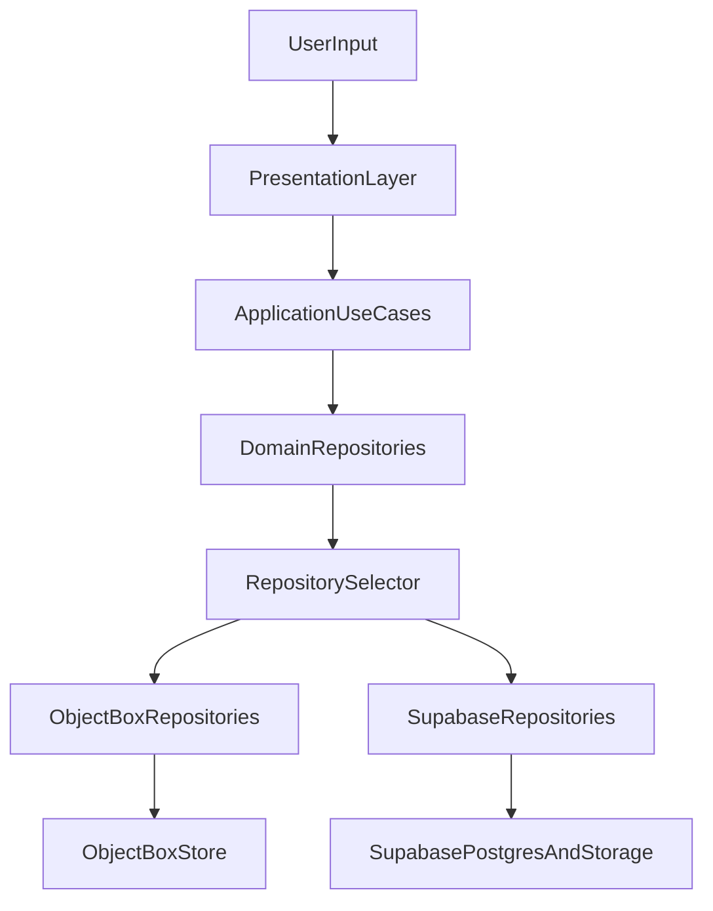

# LinkVault Technical Architecture

Version: 2.1  
Last Updated: 2026-03-24  
Status: Active  
Owner: Engineering  
Depends On: `docs/01_PRODUCT/Product_Requirements_Document.md`, `docs/04_DATA_AND_MIGRATION/Data_Persistence_State_Machine.md`, `docs/05_MONETIZATION/Monetization_Model_Free_Cloud_Quotas_and_Unit_Economics.md`, `docs/03_ARCHITECTURE/Developer_Bible.md`  
Blocks: `docs/09_RELEASE_AND_OPERATIONS/Release_Operations_Runbook.md`

---

## Purpose

Define the canonical runtime architecture for LinkVault using Curate-inspired clean architecture while preserving LinkVault domain behavior and storage model (`lv_collections` + `lv_urls`).

---

## Architecture Summary

### Core Principles

1. Single state model: Riverpod as the only app-state framework.
2. Single cloud backend: Supabase for auth, remote data, and storage.
3. Local-first persistence: ObjectBox is always available and drives offline UX.
4. Tier-aware repository selection: runtime chooses local vs cloud behavior by **guest vs authenticated**, **premium vs free**, **quotas**, **migration**, **Day Pass / entitlement**, and **connectivity** (see [Data_Persistence_State_Machine.md](../04_DATA_AND_MIGRATION/Data_Persistence_State_Machine.md)).
5. Contract-first domain: use cases and repository interfaces define behavior independently from data source.

### System Flow



---

## Layer Contracts

### Presentation Layer

- Owns UI rendering, screen state orchestration, and user interaction wiring.
- Never contains business policy decisions.
- Calls use cases only.

Allowed dependencies:

- application/usecases
- shared UI components
- Riverpod providers

Forbidden dependencies:

- direct Supabase queries
- direct ObjectBox writes
- data mappers

### Application Layer

- One use case per business action (`CreateCollection`, `AddUrl`, `ReorderUrls`, `StartCloudMigration`).
- Performs validation and orchestration.
- Returns `Either<Failure, T>` for all externally visible operations.

### Domain Layer

- Pure Dart entities and repository contracts.
- No framework-specific types except allowed primitives and `Either`.
- Represents business semantics (collection nesting, URL states, pin/archive rules).

### Data Layer

- Implements repository interfaces with local and cloud backends.
- Handles model serialization, persistence, and mapping.
- Includes conflict resolution adapter logic for sync/reconciliation.

### Infrastructure Layer

- Platform and SDK initialization: Supabase, ObjectBox, RevenueCat, AdMob, logging, connectivity.
- Environment/config loading and flavor guards.

---

## Canonical Feature Module Structure

```text
lib/
├── core/
│   ├── config/
│   ├── errors/
│   ├── infrastructure/
│   ├── providers/
│   ├── router/
│   └── utils/
├── features/
│   ├── auth/
│   ├── collections/
│   ├── urls/
│   ├── migration/
│   ├── monetization/
│   ├── search/
│   ├── rss/
│   ├── settings/
│   └── profile/
└── shared/
```

Per-feature standard:

```text
feature/
├── domain/
│   ├── entities/
│   └── repositories/
├── application/
│   └── usecases/
├── data/
│   ├── models/
│   ├── mappers/
│   └── repositories/
└── presentation/
    ├── providers/
    ├── screens/
    └── widgets/
```

---

## LinkVault Data Domain Contracts

### Collections Domain

Key semantics:

- unlimited nesting via `parentId`
- deterministic ordering via fractional `position`
- soft delete via `isDeleted` and `deletedAt`
- denormalized counters for URL count and child count

### URLs Domain

Key semantics:

- belongs to one collection
- metadata-rich records (`title`, `description`, `thumbnail`, `favicon`, `dominantColor`)
- states: `unread`, `read`, `archived`
- usage analytics: `clickCount`, `lastAccessedAt`
- soft delete and sync timestamps

---

## Repository Selection Contract

Repository implementation is selected by the state tuple (minimum):

- `isAuthenticated`
- `isPremium`
- `isGuest` (or inverse: has Supabase session for product writes)
- `withinFreeTierQuotas` / server denial on over-quota writes
- `hasMigrated` (legacy / premium migration flows where still applicable)
- `isOnline`
- `adDayPassActive` (or equivalent) when gating **app access** or **writes** per PRD

**Selection rules (canonical — align code to [Data_Persistence_State_Machine.md](../04_DATA_AND_MIGRATION/Data_Persistence_State_Machine.md)):**

1. **Guest:** local repositories (ObjectBox only) for collections/URLs.
2. **Authenticated + not premium:** **Supabase repositories** for `lv_*` as system of record, with **quota enforcement** on creates; **local cache + queue** for offline UX.
3. **Authenticated + premium + online:** cloud repositories with write-through / delta sync per sync doc.
4. **Authenticated + premium + offline:** local cache + queued sync.
5. **Premium pending migration** (if applicable): local + migration workflow until `lv_*` backfill completes.
6. **Expired premium:** downgrade path per state machine (read-only vs continued local policy).

---

## Runtime Lifecycle

### App Startup

1. Load env/flavor config.
2. Initialize ObjectBox and Supabase clients.
3. Resolve auth session and premium entitlement.
4. Resolve migration flag.
5. Build repository graph.
6. Route user to onboarding/auth/home/paywall/migration based on state.

### Mutation Flow (Example: Add URL)

1. Screen invokes `AddUrlUsecase`.
2. Use case validates URL and optional metadata.
3. Repository selector returns active URL repository implementation.
4. Active repository writes to local or cloud path per state.
5. UI updates from provider stream/notifier state.
6. Telemetry event emitted for success/failure.

---

## Error and Failure Contracts

- All use cases return `Either<Failure, T>`.
- Failures are categorized at minimum:
  - validation
  - auth
  - permissions
  - network
  - database
  - sync/migration
  - monetization
  - unexpected
- UI handles typed failures explicitly for user messaging.

---

## Non-Functional Architecture Requirements

- Cold start target: under 3s on mid-tier device.
- Search response target (local data): under 100ms median.
- Offline reliability: guest has full local CRUD; **authenticated** users use **cache + queue** when offline (writes flush when online unless product defines stricter rules).
- Data safety: no destructive migration without checkpoint/rollback path.
- Security: no hardcoded secrets; enforce RLS for all `lv_*` tables.

---

## Architecture Boundary Checklist

Before implementation starts, verify:

- no screen accesses data sources directly
- no repository leaks to UI without use case wrapper
- no feature bypasses repository selector
- no runtime uses both Firebase and Supabase for the same product data path
- no production secret exists in code

---

## Revision History

| Version | Date | Notes |
|---|---|---|
| 2.1 | 2026-03-24 | Monetization alignment: free **account** uses Supabase + quotas; guest local-only. |
| 2.0 | 2026-03-23 | Rewritten as canonical architecture contract for execution readiness. |
| 1.0 | 2026-03-20 | Initial reboot architecture draft. |
