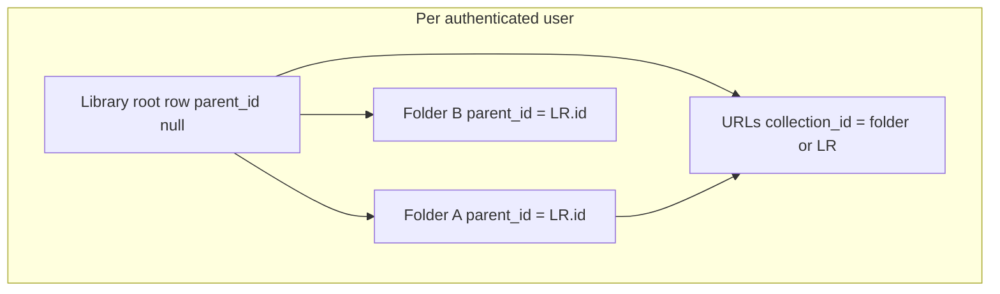
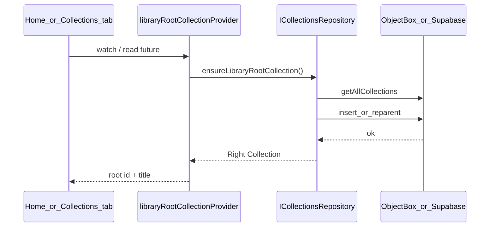

# LinkVault — Unified Collections & Items Root Architecture

Version: 1.0  
Last Updated: 2026-03-27  
Status: Active  
Owner: Engineering  
Depends On: [Home_and_Collections_UX_Architecture.md](./Home_and_Collections_UX_Architecture.md), [Technical_Architecture.md](./Technical_Architecture.md), [ADR_0003](../10_DECISIONS_AND_RISKS/ADR_0003_Home_Landing_and_Folder_Content_Model.md), [ADR_0002](../10_DECISIONS_AND_RISKS/ADR_0002_Free_Tier_Supabase_Quotas_and_Day_Pass.md), [Library_Screen_Removal_Changelog.md](../09_SPRINT_ARCHITECTURE/SPRINT_7_8_UX_REFACTOR/Library_Screen_Removal_Changelog.md)  
Related: [Supabase_Schema_and_Migrations.md](../04_DATA_AND_MIGRATION/Supabase_Schema_and_Migrations.md)

---

## 1. Purpose

This document is the **technical contract** for the **unified folder hub** model: one persisted **Library** root collection per user, one **ItemsListScreen** pattern for root and nested folders, and **lazy loading** of URL (link) data where applicable.

It exists to:

- State **invariants** that must hold for routing, queries, and UX to stay consistent.
- Explain **how** the app resolves and ensures the library root at runtime.
- Document the **duplicate “Library” rows** failure mode (often seen as 4–5 new roots per app restart) with root cause and mitigation options.
- Capture **edge cases** and a **decision framework** for future hardening without re-litigating history each sprint.

This doc does **not** replace UI specs in `docs/02_DESIGN/`; it constrains **data shape**, **provider behavior**, and **failure modes**.

---

## 2. Canonical model (hard invariants)

| ID | Invariant |
|----|-----------|
| R1 | **Exactly one** non-deleted collection per user has `parent_id` null (empty string treated like null). That row is the **Library root**. Title defaults to **“Library”** (`LibraryRootCollection.defaultTitle`). |
| R2 | **All user-created folders** (except the root) have `parent_id` set to a valid `lv_collections.id` UUID under the Library root (directly or transitively). |
| R3 | **URLs** (`lv_urls.collection_id`) are **always** a real UUID referencing `lv_collections.id`. Never filter or write PostgREST queries using string sentinels like `'root'` / `'ROOT'` on UUID columns — Postgres returns `22P02 invalid input syntax for type uuid`. |
| R4 | Legacy local item keys `'root'` / `'ROOT'` may still exist in **ObjectBox** history; local repair paths may remap them to the real library root id. **Remote** repair that used `.eq('collection_id', legacy)` was invalid for UUID columns and must not be used. |
| R5 | **Unified hub**: `/collections` resolves the persisted root id, then shows `ItemsListScreen(collectionId: root.id)` — same screen contract as `/collections/:id` for nested folders (see [CollectionsBranchRootScreen](../../lib/features/collections/presentation/screens/collections_branch_root_screen.dart)). |

**Conceptual diagram:**

---

## 3. Implementation walkthrough

### 3.1 Domain helper

[`lib/features/collections/domain/library_root_collection.dart`](../../lib/features/collections/domain/library_root_collection.dart) defines:

- Default title/category/icon for the root.
- `legacyRootItemCollectionIds` = `{'root','ROOT'}` for **local** legacy handling.
- `libraryRootIdIfExactlyOne(all)` — returns the root id only when there is **exactly one** non-deleted top-level row; otherwise `null` (ambiguous or broken tree).

### 3.2 Repository selection (local vs cloud)

[`collectionsRepositoryProvider`](../../lib/features/collections/presentation/providers/collections_providers.dart) picks:

- **Supabase** when authenticated, online, and (free tier **or** premium with cloud migration completed).
- **ObjectBox** (`CollectionsRepositoryImpl`) for guest, offline authenticated, or premium-not-yet-migrated per ADR-0002.

**Implication:** `ensureLibraryRootCollection()` runs against **different backends** depending on connectivity and migration flags. Local implementation uses a **single write transaction**; cloud uses **separate HTTP calls** (see §5).

### 3.3 Ensuring the library root

**Interface:** `ICollectionsRepository.ensureLibraryRootCollection()` — documented as idempotent in [`i_collections_repository.dart`](../../lib/features/collections/domain/repositories/i_collections_repository.dart).

**Local (`CollectionsRepositoryImpl`):** In one `runInTransaction`:

- Enumerate non-deleted collections with null/empty `parentId` → `tops`.
- If `tops.length > 1`: create a new root UUID, insert it, set each former top’s `parent_id` to the new root (reparent legacy “multi root” state), repair legacy item `collectionUid` from `'root'/'ROOT'` to the new id.
- If `tops.length == 1`: use it as root; run legacy item repair onto that id.
- If `tops.length == 0`: insert a new root row; repair legacy items.

**Cloud (`SupabaseCollectionRepository`):** Same branching logic **without** a single database transaction:

- `getAllCollections()` then filter `tops` (same definition as local).
- `tops.length > 1`: `insert` new root, then **loop** `update` each former top with `parent_id = newId`.
- `tops.length == 1`: return that row.
- `tops.length == 0`: `insert` new root.

**Critical:** The cloud path is **read → conditional insert**. Without DB uniqueness on `(owner_id)` where `parent_id IS NULL`, two concurrent executions can both observe `tops.length == 0` (or stale empty reads) and **insert multiple** Library rows.

### 3.4 Provider: `libraryRootCollectionProvider`

[`libraryRootCollectionProvider`](../../lib/features/collections/presentation/providers/collections_providers.dart) is a `FutureProvider` that:

1. `ref.watch(collectionsRepositoryProvider)` — **re-runs** when repository implementation switches (e.g. offline → online, migration flag flips).
2. `ref.watch(currentUserProvider)`.
3. Calls `repo.ensureLibraryRootCollection()` and returns the `Collection` or throws.

**Consumers (non-exhaustive):**

| Location | Usage |
|----------|--------|
| [`CollectionsBranchRootScreen`](../../lib/features/collections/presentation/screens/collections_branch_root_screen.dart) | `watch` → hub at `/collections`; **Retry** calls `invalidate(libraryRootCollectionProvider)`. |
| [`HomeDashboardScreen`](../../lib/features/home/presentation/screens/home_dashboard_screen.dart) | `watch` for library root id to scope “folders under Library”; `read(...future)` on FAB / empty state. |
| [`CreateCollectionScreen`](../../lib/features/collections/presentation/screens/create_collection_screen.dart) | `read(...future)` for default parent. |
| [`EditCollectionScreen`](../../lib/features/collections/presentation/screens/edit_collection_screen.dart) | `watch` + `read(...future)` for root-relative UI. |

### 3.5 Lazy Links tab (items / URLs)

Unified hub loads **child folders** from `collectionsListProvider` filtered by `parentId == root.id`. **URL lists** are loaded on demand when the user selects the Links tab (`UrlsDataPhase`: notStarted → loading → loaded / error), via `ItemsNotifier.ensureUrlsLoaded()` and related state in [`items_providers.dart`](../../lib/features/items/presentation/providers/items_providers.dart). This avoids fetching all URLs on every root open while Folders is the default tab.

---

## 4. Failure mode deep-dive: duplicate “Library” collections

### 4.1 Symptom

After each app restart (especially in **cloud** mode), multiple new rows appear with title **Library**, `parent_id` null, distinct UUIDs — often several in one session.

### 4.2 Root cause (primary): overlapping `ensure` without serialization

1. **`libraryRootCollectionProvider` is async and re-entrant.** When `collectionsRepositoryProvider` or `currentUserProvider` changes, Riverpod can **start a new** `ensureLibraryRootCollection()` while a previous async invocation is still in flight. Dart does not cancel the previous body.

2. **New repository instance per rebuild.** `SupabaseCollectionRepository` is constructed inline when `useCloud` is true — no long-lived singleton per user at the provider level. Each concurrent run may call `getAllCollections()` and then `insert` independently.

3. **Non-atomic cloud ensure.** Two overlapping calls can both see **zero** top-level rows (or identical snapshots before the first insert is visible) and each execute the `tops.length == 0` branch → **N inserts** of Library roots.

4. **Churn near startup.** `collectionsRepositoryProvider` watches `isOnlineProvider`, `hasMigratedToCloudProvider`, `isPremiumProvider`, `isSubscriptionActiveProvider`, etc. Rapid updates during splash/auth/settings initialization multiply **re-runs** of `libraryRootCollectionProvider`, increasing overlap probability.

5. **Explicit invalidation.** `CollectionsBranchRootScreen` Retry invalidates the provider, which can overlap with an ensure triggered by Home + Collections tab both being active in a `StatefulShellRoute` (both can `watch` the same provider).

### 4.3 Contributing factors

- **Schema:** [`004_lv_collections.sql`](../04_DATA_AND_MIGRATION/Supabase_Schema_and_Migrations.md) (see migration `004_lv_collections.sql`) defines `parent_id` nullable with **no** unique constraint “one null parent per owner”. So the database allows duplicates; the app relies on logic + idempotence.

- **Healing path `tops.length > 1`:** If duplicates already exist, ensure **creates yet another** root and reparents the former tops — correct for migration, but noisy if duplicates were caused by races (logs may show “created + reparented N”).

### 4.4 Why local-only users may see fewer duplicates

`CollectionsRepositoryImpl.ensureLibraryRootCollection` wraps the decision + writes in **one ObjectBox transaction**, serializing the read/modify/write for a single isolate’s access pattern. Races are still theoretically possible if two ensures run in parallel on different isolates, but the dominant production report for **many** duplicates aligns with **Supabase** non-atomic ensure + provider overlap.

---

## 5. Edge-case matrix

| Area | Scenario | Expected behavior | Risk if wrong |
|------|----------|-------------------|---------------|
| Startup | Cold start, online, cloud repo | Single ensure completes; one null-parent row | Duplicate Library rows |
| Startup | Offline → online transition | Repo switches local → cloud; ensure runs on new backend | Double ensure across backends if not reconciled by product rules |
| Auth | Login after guest | User changes; root is per user in cloud | Wrong user’s root cached in UI if provider not invalidated |
| Migration | `hasMigratedToCloud` flips true | May switch to Supabase mid-session | Overlapping ensures on both sides if not carefully sequenced |
| Premium | RC inactive, read-only cloud | `ReadOnlyCollectionsRepository` — ensure still forwarded | Read-only might still **read** duplicates created earlier; creation policy should be explicit |
| Retry | User taps Retry on root error | `invalidate(libraryRootCollectionProvider)` | New concurrent ensure while another pending |
| Multi-top | Legacy data: several null-parent folders | Supabase/local: insert new root, reparent all | Temporary UI flurry; must converge to one root |
| Empty account | No rows | Insert one Library root | Race → N inserts |
| Legacy items | Items with `collection_id` `root`/`ROOT` | Local repair in transaction | Remote UUID filters must not use legacy strings |
| Links tab | User never opens Links | URLs not loaded (`UrlsDataPhase.notStarted`) | Correct; no wasted fetch |
| Edit screen | Open edit without visiting Links tab | `ensureUrlsLoaded()` post-frame if items list shown | Must not assume URLs already loaded |

---

## 6. Decision framework: mitigation options (future implementation)

These options are **documented for planning**; combine as needed.

### Option A — App-side single-flight (mutex / in-flight Future)

- **Idea:** For a given `userId`, only one `ensureLibraryRootCollection()` runs at a time; concurrent callers await the same `Future`.
- **Pros:** Fixes overlapping client calls without DB migration; works with current schema.
- **Cons:** Must be applied in the right layer (repository or a small coordinator) so all entry points share it; still vulnerable if **two devices** race (see Option B).

### Option B — Database uniqueness (strongest invariant)

- **Idea:** Partial unique index, e.g. one row per `owner_id` where `parent_id IS NULL` and `is_deleted = false` (exact predicate depends on soft-delete semantics).
- **Pros:** Server-enforced; second insert fails safely; can combine with retry.
- **Cons:** Requires migration + handling of existing duplicate rows (merge/delete/script); RLS policies must align.

### Option C — RPC / transactional ensure

- **Idea:** Postgres function `ensure_library_root(owner_id)` runs `SELECT … FOR UPDATE` / single transaction.
- **Pros:** Atomic; clear semantics.
- **Cons:** More moving parts; client must call RPC instead of plain insert from Flutter.

### Option D — Stabilize provider triggers

- **Idea:** Reduce unnecessary `ref.watch(collectionsRepositoryProvider)` coupling on `libraryRootCollectionProvider`, or debounce/coalesce startup signals so ensure runs once per stable session.
- **Pros:** Fewer redundant ensures.
- **Cons:** Does not alone fix true parallelism; pairs best with A or B.

**Suggested phased approach:**

1. **Short term:** Option A (+ structured logging around ensure start/end).
2. **Medium term:** Option B after auditing duplicate rows in production/staging.
3. **Ongoing:** Option D to reduce churn.

---

## 7. Operational runbook

### 7.1 Diagnose

- **Supabase SQL (support / one-off):** Count null-parent rows per user:  
  `select owner_id, count(*) from lv_collections where parent_id is null and is_deleted = false group by owner_id having count(*) > 1;`
- **App logs:** Search for `[collections] ensureLibraryRoot` in [`AppLogger`](../../lib/core/utils/app_logger.dart) output from `SupabaseCollectionRepository` / `CollectionsRepositoryImpl`.

### 7.2 Contain

- Avoid repeated **Retry** taps on root error screens during investigation (invalidates provider).
- Prefer fixing **client single-flight** before manual row deletion to avoid partial state.

### 7.3 Clean up (data repair)

- Duplicates require **product decision**: pick canonical root id, reparent children from orphan roots, soft-delete or merge extras. Do **not** delete blindly if URLs reference those ids — update `lv_urls.collection_id` in the same maintenance window.

---

## 8. QA and validation checklist

Use this after any change to root ensure or `libraryRootCollectionProvider`.

**Restart stability (cloud user)**

1. Log in with test account; note `lv_collections` count of `parent_id is null` (should be 1).
2. Kill app; cold start 5 times.
3. Re-query DB — count must remain **1** (not +1 per restart).

**Tab / shell**

4. With Home and Collections both having loaded, confirm no explosion of Library rows after switching tabs rapidly at cold start.

**Offline / online**

5. Start offline (local repo); go online; confirm single root after sync path (per product rules).

**Error + Retry**

6. Simulate ensure failure (e.g. network off); tap Retry once; verify single ensure completion, no duplicate storm.

**Nested + Links**

7. Open `/collections`, stay on Folders — no requirement for URL fetch. Switch to Links — URLs load; pull-to-refresh works.
8. Open nested folder `/collections/:id` — same tab behavior.

**Edit collection**

9. Open edit for a folder — if items list is shown, URLs load without requiring Links tab on hub first.

---

## 9. Future work and test backlog

| Item | Type |
|------|------|
| Integration test: mock repo to simulate concurrent `ensureLibraryRootCollection` and assert single insert contract | Test |
| Optional E2E against Supabase test project with network delay | QA |
| ADR update if DB unique constraint is added | Doc |
| Align [Library_Screen_Removal_Changelog.md](../09_SPRINT_ARCHITECTURE/SPRINT_7_8_UX_REFACTOR/Library_Screen_Removal_Changelog.md) “sentinel `__root__`” draft with **implemented** persisted UUID root (changelog mixes early spec with later implementation note) | Doc cleanup |

---

## 10. Changelog

| Version | Date | Notes |
|---------|------|--------|
| 1.0 | 2026-03-27 | Initial canonical doc: invariants, flows, duplicate root analysis, edge matrix, mitigations, QA checklist |
