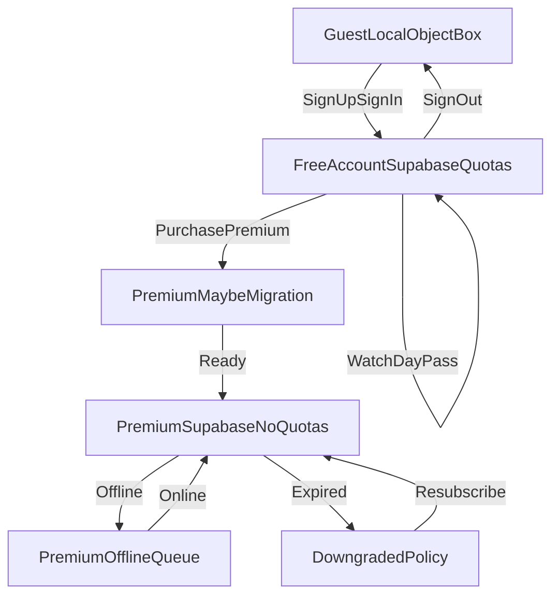

# LinkVault Data Persistence State Machine

Version: 2.0  
Last Updated: 2026-03-24  
Status: Active  
Owner: Engineering  
Depends On: `docs/03_ARCHITECTURE/Technical_Architecture.md`, `docs/04_DATA_AND_MIGRATION/Cloud_Sync_and_Reconciliation.md`, `docs/05_MONETIZATION/Monetization_Model_Free_Cloud_Quotas_and_Unit_Economics.md`, `docs/10_DECISIONS_AND_RISKS/ADR_0002_Free_Tier_Supabase_Quotas_and_Day_Pass.md`

---

## Purpose

Define exactly which repository and write policy is active for each user state combination.

---

## State Inputs

| Input | Source |
|---|---|
| `isAuthenticated` | Supabase auth session |
| `isPremium` | RevenueCat entitlement evaluation |
| `withinFreeQuota` | server quota check + client mirror (collections/URLs caps for free tier) |
| `hasMigrated` | local persisted migration flag (guest→account upload done; premium legacy migration if any) |
| `isOnline` | connectivity service |
| `adDayPassAllowsUse` | Day Pass / trial evaluation (PRD) |
| `allowWritesWhenDowngraded` | product policy switch |

---

## Canonical States (v2 — free account = cloud)

| State ID | Guest | Auth | Premium | Online | Primary persistence | Write policy |
|---|---|---|---|---|---|---|
| S1 | yes | no | no | any | **ObjectBox** | Full local |
| S2 | no | yes | no | yes | **Supabase `lv_*` + cache** | Full if `adDayPassAllowsUse` + `withinFreeQuota` |
| S3 | no | yes | no | no | Cache + queue | Queue or read-only per product |
| S4 | no | yes | yes | no | n/a | **Premium pending migration** (local + migration UI) |
| S5 | no | yes | yes | yes | **Supabase + cache** | Full (no quota wall) |
| S6 | no | yes | yes | no | Cache + queue | Queued sync |
| S7 | — | — | transition | any | Migration service | Controlled (guest→account or premium backfill) |
| S8 | no | yes | expired | any | Policy | Downgrade: read-only or local per ADR/product |

**Deprecated (v1):** “Free authenticated = local-only until premium” — replaced by **S2/S3** above per **ADR-0002**.

---

## Transition Diagram



---

## Repository Resolution Rules

1. **Guest (`!isAuthenticated`):** inject **local** repositories only for collections/URLs.
2. **Authenticated + `!isPremium` + online:** inject **Supabase** repositories; enforce **quotas** on create (server + client); respect **Day Pass** for gated actions per PRD.
3. **Authenticated + `!isPremium` + offline:** **cache** reads; **queue** writes or block with UX per product.
4. **Premium + migration incomplete:** local + migration flow until cloud backfill verified.
5. **Premium + migrated + online:** cloud + delta sync per [Cloud_Sync_and_Reconciliation.md](Cloud_Sync_and_Reconciliation.md).
6. **Premium + migrated + offline:** cache + queue.
7. **Premium expired:** downgrade policy (no silent data loss without explicit product decision).

---

## Required Provider Contract (Reference — pseudocode)

Implementations must reflect **S2 = Supabase for free account**, not local-only.

```dart
final persistenceStateProvider = Provider<PersistenceState>((ref) {
  final auth = ref.watch(authSessionProvider).valueOrNull != null;
  final premium = ref.watch(premiumStatusProvider).valueOrNull ?? false;
  final migrated = ref.watch(hasMigratedProvider);
  final online = ref.watch(connectivityProvider).valueOrNull ?? false;

  if (!auth) return PersistenceState.guestLocal;
  if (!premium) {
    return online ? PersistenceState.freeCloudOnline : PersistenceState.freeCloudOffline;
  }
  if (premium && !migrated) return PersistenceState.premiumPendingMigration;
  if (premium && migrated && online) return PersistenceState.premiumCloudOnline;
  if (premium && migrated && !online) return PersistenceState.premiumCloudOffline;
  return PersistenceState.downgraded;
});
```

---

## Migration Gate Rules

**Guest → account (S7):** upload local ObjectBox collections/URLs to `lv_*` under new `owner_id`; idempotent; set flag when verified.

**Premium pending migration (S4)** requires:

- valid authenticated Supabase user
- premium entitlement true
- migration flag false (e.g. legacy builds or explicit backfill only)

**S4 exit to S5** only after:

- collections and URLs migration completed (if applicable)
- post-migration verification pass succeeds
- migration flag persisted true

---

## Downgrade Policy

Recommended baseline:

- preserve local data access
- stop cloud sync/writes while entitlement is inactive
- allow resubscribe to resume cloud sync from last consistent checkpoint

Optional strict mode:

- read-only enforcement for modified entities created after downgrade timestamp

---

## QA Scenarios (Minimum)

1. Guest -> **sign up** -> **cloud rows created** under `owner_id` -> continue CRUD within quota.
2. Free account at quota -> create blocked -> upgrade to premium -> create succeeds.
3. Free account offline -> queued writes -> online -> flush -> Supabase consistent.
4. Premium upgrade (from free) -> limits lifted -> optional reconciliation pass.
5. Premium expiry -> downgrade behavior matches policy.
6. Day Pass expired -> app gate; cloud data still owned by user (no spurious delete).

---

## Revision History

| Version | Date | Notes |
|---|---|---|
| 2.0 | 2026-03-24 | **ADR-0002:** free **account** uses Supabase + quotas; guest local-only. Updated states, diagram, QA. |
| 1.0 | 2026-03-23 | New canonical persistence state model in `04_DATA_AND_MIGRATION`. |
