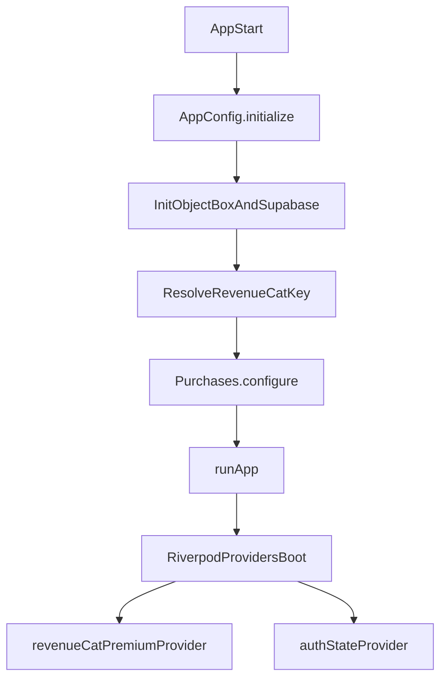
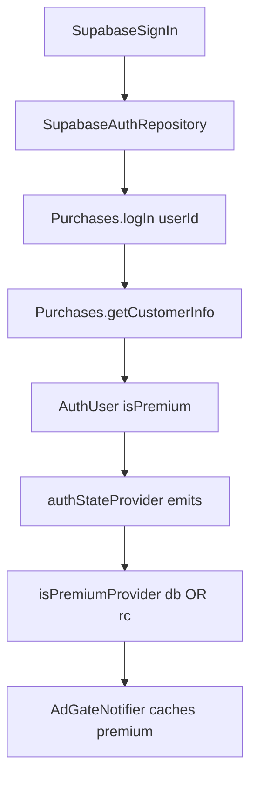
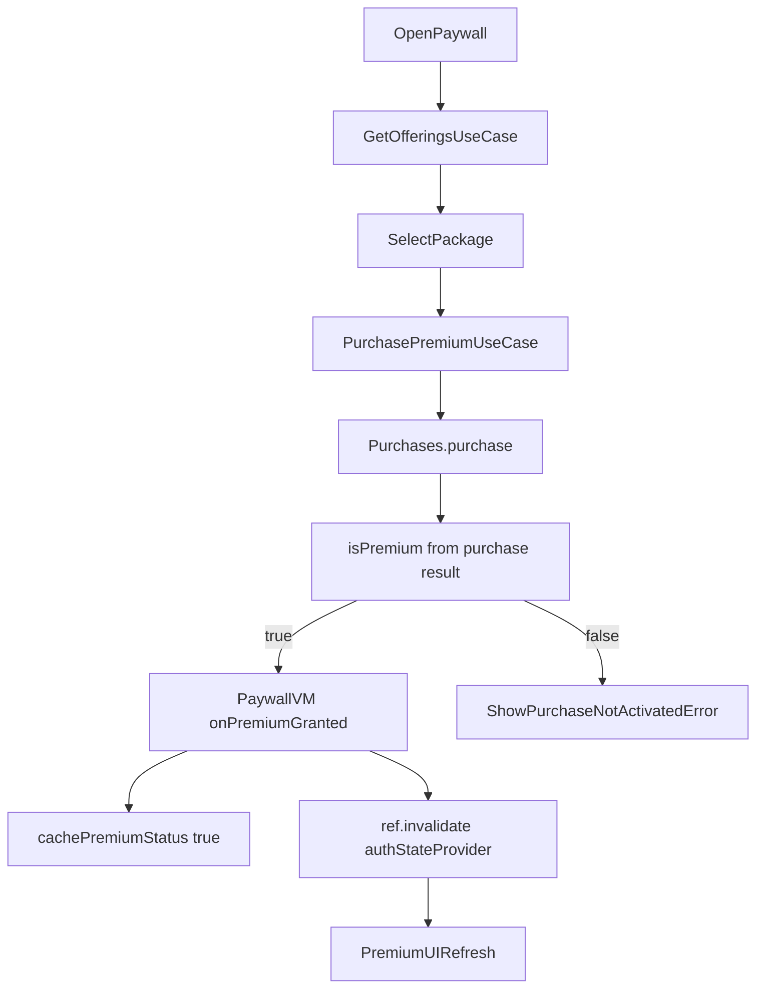
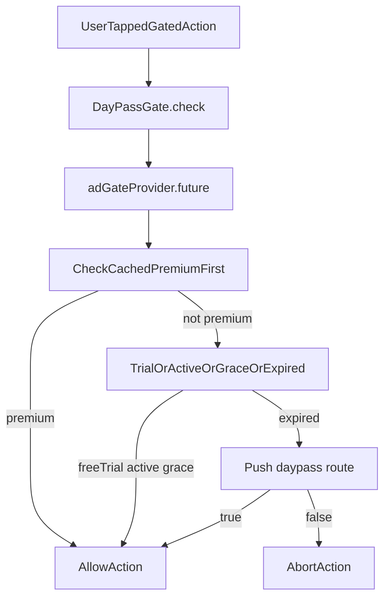

# LinkVault RevenueCat Setup and Architecture (Deep Dive)

Version: 1.0  
Last Updated: 2026-03-30  
Status: Active  
Owner: Engineering  
Related:
- [Monetization_Strategy_RevenueCat_Guide.md](Monetization_Strategy_RevenueCat_Guide.md)
- [Monetization_Model_Free_Cloud_Quotas_and_Unit_Economics.md](Monetization_Model_Free_Cloud_Quotas_and_Unit_Economics.md)
- [Premium_Feature_Gating_Matrix.md](../01_PRODUCT/Premium_Feature_Gating_Matrix.md)
- [ADR_0002_Free_Tier_Supabase_Quotas_and_Day_Pass.md](../10_DECISIONS_AND_RISKS/ADR_0002_Free_Tier_Supabase_Quotas_and_Day_Pass.md)

---

## 1) Why this document exists

This is the code-accurate architecture guide for how RevenueCat and DayPass work in LinkVault.

Use this doc when you need to answer:
- "Where is RevenueCat configured?"
- "How is premium computed in UI?"
- "What happens on sign-in/sign-out?"
- "How does premium affect DayPass and repository routing?"
- "Why can there be temporary mismatch between paywall and gate state?"

This document is intentionally implementation-first (file references and real provider flow), not just product intent.

---

## 2) Canonical tier model (context)

From product/docs:
- Guest: local ObjectBox, DayPass gate after trial.
- Free authenticated: Supabase `lv_*` with quota enforcement + DayPass.
- Premium: no ads + higher limits.

RevenueCat is the runtime source for entitlement updates, while app settings cache and auth profile state are used for fast gating and resilience.

---

## 3) Architecture map (components and responsibilities)

### 3.1 Startup and configuration

- Bootstrap initializes app config, ObjectBox, Supabase, then RevenueCat:
  - [bootstrap.dart](../../lib/bootstrap.dart)
  - [app_config.dart](../../lib/core/config/app_config.dart)

Key behavior:
- `AppConfig.instance.revenueCatKey` selects iOS vs Android key.
- `Purchases.configure(PurchasesConfiguration(rcKey))` is called once at startup.
- If Supabase user exists at startup, `configuration.appUserID = user.id` is set before configure.

### 3.2 RevenueCat data access layer

- Repository implementation:
  - [revenuecat_premium_repository.dart](../../lib/features/monetization/data/repositories/revenuecat_premium_repository.dart)
- Domain contract:
  - [i_premium_repository.dart](../../lib/features/monetization/domain/repositories/i_premium_repository.dart)
- Main operations:
  - `checkPremiumStatus() -> Purchases.getCustomerInfo()`
  - `watchPremiumStatus() -> addCustomerInfoUpdateListener`
  - `getOfferings() -> Purchases.getOfferings()`
  - `purchasePackage() -> Purchases.purchase(...)`
  - `restorePurchases() -> Purchases.restorePurchases()`

Important implementation detail:
- Purchase and restore use return payload directly (`customerInfo`) rather than relying on a follow-up `getCustomerInfo()` call.

### 3.3 Providers and view models

- Monetization providers:
  - [premium_provider.dart](../../lib/features/monetization/presentation/providers/premium_provider.dart)
  - [subscription_status_provider.dart](../../lib/features/monetization/presentation/providers/subscription_status_provider.dart)
  - [paywall_view_model.dart](../../lib/features/monetization/presentation/providers/paywall_view_model.dart)
- Auth premium composition:
  - [auth_providers.dart](../../lib/features/auth/presentation/providers/auth_providers.dart)

Key state providers:
- `revenueCatPremiumProvider` (stream from RevenueCat listener).
- `isPremiumProvider = dbPremium || rcPremium`.
  - `dbPremium` comes from `AuthUser.isPremium` (profile/auth stream).
  - `rcPremium` comes from RevenueCat live stream.

### 3.4 DayPass and premium cache bridge

- DayPass status provider:
  - [ad_gate_provider.dart](../../lib/features/monetization/presentation/providers/ad_gate_provider.dart)
- DayPass status algorithm:
  - [check_ad_access_usecase.dart](../../lib/features/monetization/domain/usecases/check_ad_access_usecase.dart)
- App settings persistence:
  - [app_settings_repository.dart](../../lib/core/data/repositories/app_settings_repository.dart)

Bridge behavior:
- `AdGateNotifier.build()` watches `isPremiumProvider` and writes cache:
  - `daypassRepository.cachePremiumStatus(isPremium: isPremium)`
- `CheckAdAccessUseCase` checks cached premium first.
  - If true, DayPass status is `premium` and ad gate is bypassed.

This gives fast gate decisions even when network or RevenueCat refresh is delayed.

### 3.5 Auth lifecycle integration

- Auth repository logs in RevenueCat when validating user premium:
  - [supabase_auth_repository.dart](../../lib/features/auth/data/repositories/supabase_auth_repository.dart) (`_checkPremium()` calls `Purchases.logIn(userId)` then `getCustomerInfo()`).
- Auth notifier logs out RevenueCat during sign-out:
  - [auth_notifier.dart](../../lib/features/auth/presentation/providers/auth_notifier.dart) (`Purchases.logOut()` non-fatal on failure).

---

## 4) End-to-end flow diagrams

### 4.1 App startup

### 4.2 Auth sign-in premium sync

### 4.3 Paywall purchase

### 4.4 DayPass gate decision

---

## 5) RevenueCat setup checklist (LinkVault-specific)

## 5.1 Dashboard prerequisites

1. RevenueCat project exists and includes LinkVault apps per platform.
2. Entitlement key is exactly: `premium`.
3. Default offering configured with monthly and annual packages.
4. Product IDs and base plans match store console definitions.
5. Test Store products attached for dev environment.

## 5.2 Env and key mapping

Configured through:
- [app_config.dart](../../lib/core/config/app_config.dart)
- `.env.dev` and `.env.production`

Rules:
- Dev uses `test_` keys.
- Android production uses `goog_`.
- iOS production uses `appl_`.
- Never mix platform keys.

## 5.3 Boot order requirements

1. Load `.env`.
2. `AppConfig.initialize()`.
3. Initialize local and cloud infra.
4. Configure RevenueCat.
5. Run app / providers.

Current implementation satisfies this in [bootstrap.dart](../../lib/bootstrap.dart).

---

## 6) State model: which source is authoritative?

There are three premium-related sources in runtime:

1. RevenueCat live entitlement (`revenueCatPremiumProvider`)  
   - Most current subscription state.
2. Supabase/auth profile premium flag (`AuthUser.isPremium`)  
   - Used for app auth stream and server profile coherence.
3. Local DayPass premium cache (`AppSettingsRepository.isPremiumCached`)  
   - Fast gate decision for DayPass check path.

Combined policy in app:
- UI premium checks: `isPremiumProvider = dbPremium || rcPremium`.
- DayPass bypass: cached premium checked first in `CheckAdAccessUseCase`.

Implication:
- Small transient mismatch can happen around login/purchase boundaries if streams update at different moments.
- System converges when auth provider and RC listener settle; DayPass cache sync in `AdGateNotifier.build()` helps convergence.

---

## 7) How premium influences data backend selection

Data backend routing provider:
- [data_backend_selection_provider.dart](../../lib/core/providers/data_backend_selection_provider.dart)

Inputs:
- `hasMigratedToCloudProvider`
- `currentUserProvider`
- `isOnlineProvider`
- `isPremiumProvider`
- `revenueCatPremiumProvider` (for `isActive` read-only cloud logic)

This means monetization and storage routing are coupled by design:
- Premium/auth state changes can affect repository mode and read-only behavior.

---

## 8) Common confusion points (and exact answers)

### "I purchased, but premium UI did not update instantly"

Check:
- `PaywallViewModel._onPremiumGranted()` sets local cache + invalidates auth provider.
- RC listener stream is active (`revenueCatPremiumProvider`).
- Entitlement key is exactly `premium`.

### "DayPass says free trial after many dev days"

Likely install date reset in local settings (reinstall/clear data/flavor change).
See:
- `setInstallDateIfNotSet()`
- `getInstallDate()` in [app_settings_repository.dart](../../lib/core/data/repositories/app_settings_repository.dart)

### "Premium user still hits ad gate briefly"

Check:
- Cached premium sync from `AdGateNotifier.build()`.
- `isPremiumProvider` values (`dbPremium`, `rcPremium`) around startup.
- Auth + RC login sequencing in `_checkPremium()`.

### "Empty entitlements in sandbox"

Check RevenueCat setup and app key mapping first (wrong key or offering attachment is most common).

---

## 9) Operational debugging runbook

When debugging premium issues, capture these in order:

1. Startup logs from [bootstrap.dart](../../lib/bootstrap.dart):
   - RevenueCat configured line.
2. Auth logs around sign-in/out:
   - `Purchases.logIn(userId)` path.
   - `Purchases.logOut()` on sign-out.
3. Paywall logs:
   - offerings fetch
   - purchase/restore result entitlements
4. Provider snapshots:
   - `revenueCatPremiumProvider`
   - `isPremiumProvider`
   - DayPass debug values (install date, cached premium, expiresAt).

If needed, open Profile -> Debug -> DayPass/AppSettings debug for local cache visibility.

---

## 10) Guardrails for future changes

1. Keep `premium` entitlement key stable unless migration is planned.
2. Do not remove `purchase()` and `restorePurchases()` direct return handling.
3. Keep auth and RC identity aligned by `supabaseUserId`.
4. Maintain DayPass premium cache updates in `AdGateNotifier`.
5. Any repository routing change must be validated against:
   - [Premium_Feature_Gating_Matrix.md](../01_PRODUCT/Premium_Feature_Gating_Matrix.md)
   - [Data_Persistence_State_Machine.md](../04_DATA_AND_MIGRATION/Data_Persistence_State_Machine.md)

---

## 11) Quick implementation index

- Startup config: [bootstrap.dart](../../lib/bootstrap.dart)
- Env key selection: [app_config.dart](../../lib/core/config/app_config.dart)
- RC repo: [revenuecat_premium_repository.dart](../../lib/features/monetization/data/repositories/revenuecat_premium_repository.dart)
- Premium stream provider: [premium_provider.dart](../../lib/features/monetization/presentation/providers/premium_provider.dart)
- Paywall orchestration: [paywall_view_model.dart](../../lib/features/monetization/presentation/providers/paywall_view_model.dart)
- Auth + RC identity: [supabase_auth_repository.dart](../../lib/features/auth/data/repositories/supabase_auth_repository.dart), [auth_notifier.dart](../../lib/features/auth/presentation/providers/auth_notifier.dart)
- DayPass cache + status: [ad_gate_provider.dart](../../lib/features/monetization/presentation/providers/ad_gate_provider.dart), [check_ad_access_usecase.dart](../../lib/features/monetization/domain/usecases/check_ad_access_usecase.dart)
- Local settings persistence: [app_settings_repository.dart](../../lib/core/data/repositories/app_settings_repository.dart)

