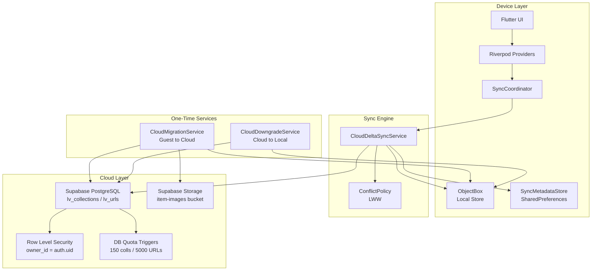
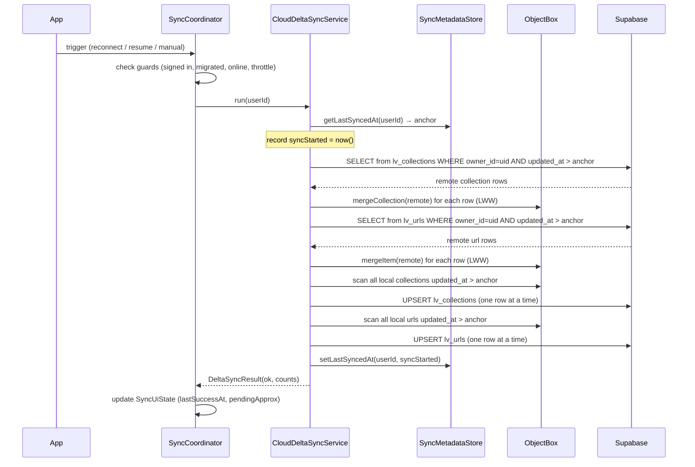
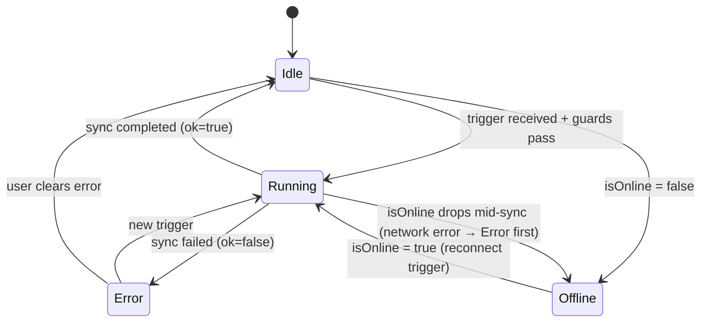
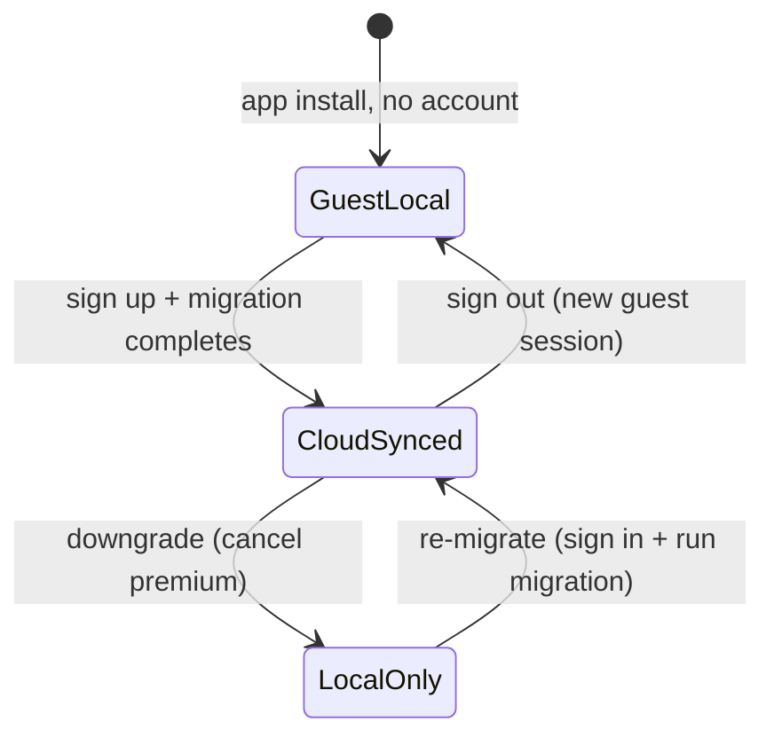
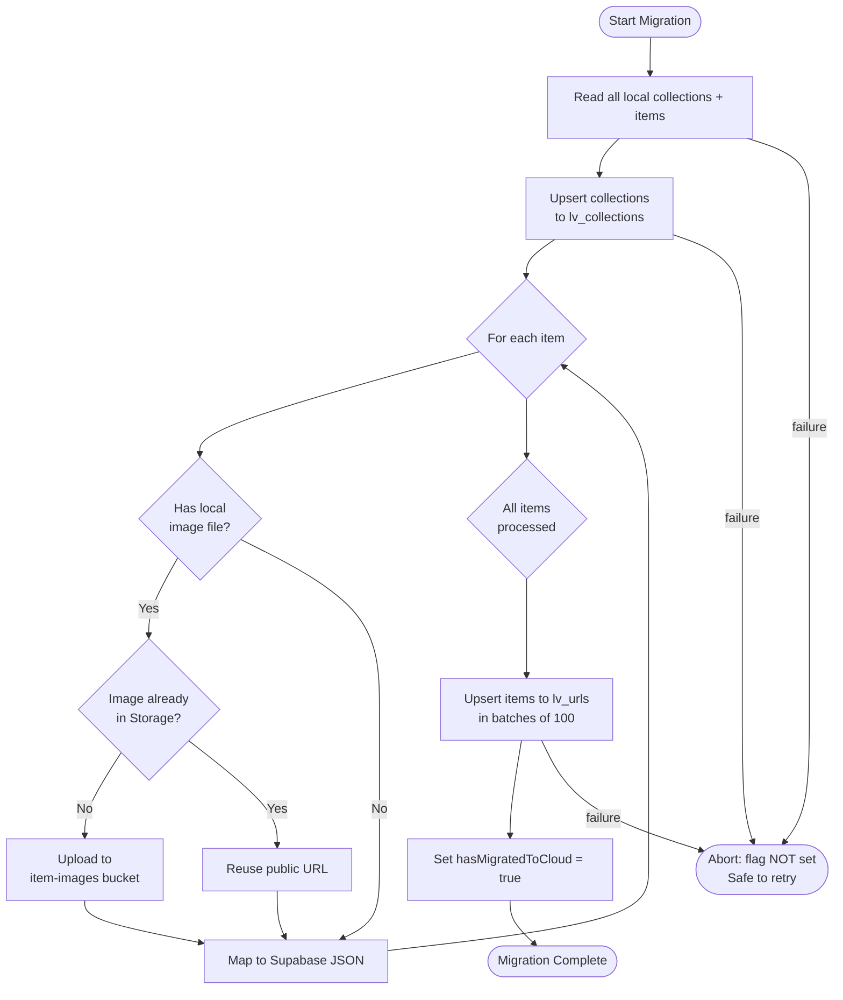

# Week 12 — Cloud Sync Architecture, Decisions & Learning Guide

**Version:** 1.0  
**Sprint:** 11–12 (Monetization & Cloud Sync)  
**Audience:** Current and future developers, architectural reviewers  
**Status:** Architecture complete, QA in progress

**Implementation note:** Hardening pass adds batched push upserts, bounded transient retry around the full delta cycle (anchor still advances only on complete success), `CloudSyncTrigger` telemetry, `DeltaSyncErrorKind` for user-facing errors, and `syncCoordinatorConfigProvider` for testable throttle/batch/retry tuning. See sprint snapshot “Week 12 implementation baseline”.

---

## Table of Contents

1. [Context and Goals](#1-context-and-goals)
2. [Architecture at a Glance](#2-architecture-at-a-glance)
3. [Data Model and Boundaries](#3-data-model-and-boundaries)
4. [Sync Triggers and Lifecycle](#4-sync-triggers-and-lifecycle)
5. [Conflict Policy and Consistency Model](#5-conflict-policy-and-consistency-model)
6. [Migration and Downgrade Architecture](#6-migration-and-downgrade-architecture)
7. [Failure Handling and Reliability Model](#7-failure-handling-and-reliability-model)
8. [Security and Tenancy Controls](#8-security-and-tenancy-controls)
9. [Scalability Model and Evolution Path](#9-scalability-model-and-evolution-path)
10. [Decision Log](#10-decision-log)
11. [Validation Evidence Map](#11-validation-evidence-map)
12. [Incident Playbook Appendix](#12-incident-playbook-appendix)
13. [Glossary](#13-glossary)

---

## 1. Context and Goals

### The problem this sprint solves

LinkVault is a link-saving app. Its data (collections, saved URLs) has value only if it is:

- **Safe**: not lost when a device is wiped or replaced.
- **Available offline**: readable and writable without a network connection.
- **Eventually consistent across devices**: changes on one device reach other devices.

Before Sprint 11–12, the app had two storage modes: local-only (ObjectBox, guests) and cloud-only (Supabase, signed-in users). There was no synchronization layer — the app simply switched repositories based on auth state, which meant local data created as a guest was stranded when the user signed up.

**Sprint 12 adds:**
1. A delta sync engine that keeps the local device and Supabase in sync.
2. A one-time guest→cloud migration path so pre-signup data is not lost.
3. A downgrade path so users who cancel premium can still access their data locally.

### Design philosophy: local-first

The app treats the device as the primary store and the cloud as the durable mirror. Writes go to ObjectBox first. The sync engine then propagates changes to Supabase asynchronously. The user always has read/write access even when offline. This is called "local-first" architecture.

Local-first means:
- The app never blocks a user action waiting for a network call.
- Sync failures are silent to the user unless they try to sync manually.
- The user experience is identical on-device whether online or offline.

The tradeoff: two devices editing the same item concurrently will have a conflict. The chosen resolution strategy is Last-Write-Wins (LWW) on `updated_at`, explained in section 5.

---

## 2. Architecture at a Glance

### Layer diagram



### Component responsibilities summary

| Component | File | Role |
|-----------|------|------|
| `SyncCoordinator` | `sync_coordinator_provider.dart` | Triggers sync on reconnect/resume/manual; exposes UI state |
| `CloudDeltaSyncService` | `cloud_delta_sync_service.dart` | Executes pull→merge→push cycle |
| `ConflictPolicy` | `conflict_policy.dart` | LWW decision: remote replaces local if newer |
| `SyncMetadataStore` | `sync_metadata_store.dart` | Persists per-user UTC sync anchor in SharedPreferences |
| `CloudMigrationService` | `cloud_migration_service.dart` | One-time bulk upload from ObjectBox to Supabase |
| `CloudDowngradeService` | `cloud_downgrade_service.dart` | Import cloud data to local and/or delete remote |

---

## 3. Data Model and Boundaries

### Why two separate tables (`lv_collections`, `lv_urls`) and not one?

Collections and URLs have a parent-child relationship (a URL belongs to a collection). Keeping them in separate tables lets Supabase enforce referential integrity with a foreign key constraint, enables efficient per-collection queries with a targeted index, and mirrors the ObjectBox model closely (avoiding complex transform logic).

Using a single document store (e.g., one JSON blob per user) would make quota enforcement, indexing, and partial updates far more complex.

### Schema: `lv_collections`

```
id          UUID  PK  -- Stable, device-generated UUID
owner_id    UUID  FK  -- Supabase auth user; RLS-enforced
parent_id   UUID  FK SELF  -- Hierarchical collections (nullable = root)
title       TEXT
icon_name   TEXT
color_hex   TEXT
category    TEXT
is_pinned   BOOLEAN
is_archived BOOLEAN
position    FLOAT8  -- Fractional positioning for reorder without renumbering
url_count   INT     -- Denormalized count (maintained client-side)
child_count INT     -- Denormalized count
is_deleted  BOOLEAN -- Soft delete: row stays for conflict resolution
deleted_at  TIMESTAMPTZ
created_at  TIMESTAMPTZ
updated_at  TIMESTAMPTZ  -- CRITICAL: sync anchor and LWW discriminator
```

### Schema: `lv_urls`

```
id             UUID  PK
owner_id       UUID  FK  -- RLS anchor
collection_id  UUID  FK lv_collections  -- Cascade delete
url            TEXT
title          TEXT
description    TEXT
thumbnail_url  TEXT
favicon_url    TEXT
dominant_color TEXT
tags           TEXT  -- Comma-separated; no separate tags table (see decision D4)
annotation     TEXT
site_name      TEXT
canonical_url  TEXT
content_type   TEXT
published_at   TIMESTAMPTZ
status         TEXT  CHECK (unread / read / archived)
is_pinned      BOOLEAN
click_count    INT
position       FLOAT8
is_deleted     BOOLEAN  -- Soft delete
deleted_at     TIMESTAMPTZ
last_accessed_at TIMESTAMPTZ
created_at     TIMESTAMPTZ
updated_at     TIMESTAMPTZ  -- CRITICAL for sync
```

### Why soft-delete (`is_deleted`) instead of hard DELETE?

Hard deletes break sync. If device A deletes a row and device B is offline, when B syncs it would push the deleted row back because it has a newer `updated_at`. With soft delete:

1. The delete is expressed as `is_deleted = true, updated_at = now()`.
2. LWW correctly applies it: whichever device has the most recent `updated_at` wins.
3. Garbage collection (purging old soft-deleted rows) is a separate, scheduled operation and does not block sync correctness.

### Key indexes

```sql
-- Efficient delta pull: "give me everything for this user newer than anchor"
CREATE INDEX idx_lv_urls_owner_updated        ON lv_urls(owner_id, updated_at DESC);
CREATE INDEX idx_lv_collections_owner_updated ON lv_collections(owner_id, updated_at DESC);

-- Efficient URL list load for a collection
CREATE INDEX idx_lv_urls_collection_pos ON lv_urls(collection_id, is_deleted, is_pinned DESC, position);

-- Full-text search across title, description, tags, URL
CREATE INDEX idx_lv_urls_search ON lv_urls USING GIN (to_tsvector(...));
```

### Sync anchor

The sync anchor is a single UTC timestamp stored in SharedPreferences per user:

```
key:   lv_last_cloud_sync_at_v1_{userId}
value: 2026-03-31T14:20:05.000Z  (ISO-8601 UTC)
```

On the first sync (no anchor) the entire user's dataset is pulled and pushed. On subsequent syncs, only rows newer than the anchor are exchanged. This makes syncs O(changed rows) rather than O(all rows).

The anchor advances to `syncStarted` (captured at the beginning of `run()`) only when the full cycle succeeds. If the cycle fails halfway, the anchor does not advance. The next sync re-attempts from the last good anchor.

---

## 4. Sync Triggers and Lifecycle

### What triggers a sync

| Trigger | How it fires | Guard conditions |
|---------|-------------|-----------------|
| App goes online | `isOnlineProvider` changes false→true | User signed in + migrated |
| App resumes from background | `SyncCoordinator.onAppResumed()` called from lifecycle handler | User signed in + migrated + online |
| Manual "Sync now" | User taps sync button in Profile screen | User signed in + migrated + online |

Auto syncs are throttled: if the last auto-sync was less than 10 seconds ago, the trigger is silently dropped. Manual syncs are never throttled.

### Sync lifecycle (step by step)



### SyncCoordinator state machine



### The pending estimate

The UI displays "N items pending sync." This number is an approximation, not a guarantee:

```dart
// Counts local rows with updated_at > last anchor for this user
CloudDeltaSyncService.countPendingForUser(store, userId, anchor)
```

It is an estimate because:
- It counts local rows regardless of whether they are already in Supabase.
- On a fresh install with a fresh anchor, all local rows appear pending even if they are already synced from another device.
- After a successful sync the count drops to near-zero but may not be exactly zero due to rows updated during the sync cycle itself.

---

## 5. Conflict Policy and Consistency Model

### What conflict means in this system

A conflict occurs when the same entity (identified by UUID) has been edited on two devices between syncs. When the second device syncs, it will pull a remote version that differs from its local version.

### Last-Write-Wins (LWW) on `updated_at`

```dart
static bool remoteIsNewer(DateTime localUpdated, DateTime remoteUpdated) {
  return remoteUpdated.isAfter(localUpdated);
}
```

The rule is simple: the row with the more recent `updated_at` wins. If remote is newer, the local copy is replaced. If local is newer, it is pushed over the remote copy on the push phase.

### Why LWW was chosen

| Property | LWW (chosen) | CRDT | Operational Transform | Manual merge |
|----------|-------------|------|-----------------------|-------------|
| Implementation complexity | Low | Very high | Very high | Medium |
| Correctness for link data | Sufficient | Perfect | Perfect | Perfect |
| Requires server intelligence | No | No | Yes | Yes |
| User-visible merge UI needed | No | No | Optional | Yes |
| Handles concurrent edits | Lose one | Merge both | Merge both | User decides |

For link-saving data, "last writer wins" is almost always the right answer. The user edited a URL's title on their phone — that's the version they want. They are not collaboratively editing the same document. Lost concurrent edits are extremely rare because users rarely edit the same item from two devices within the same sync window.

If LWW is wrong for a particular field (e.g., `click_count` should add, not replace), that field would need special handling. Currently `click_count` uses LWW, which means a count on one device can overwrite a higher count from another. This is an accepted imprecision for an informational counter.

### Consistency model

This system provides **eventual consistency** with **monotonic update** guarantees within a single device. What this means:

- If two devices are offline and sync independently, they will converge to the same state after both sync.
- There is no guarantee of total ordering across devices.
- A user will never see a read return a version older than what they last wrote on the same device (monotonic read on device).
- A write on one device will eventually reach all other devices (eventual convergence).

What this system does NOT provide:
- Strong consistency (two devices could transiently show different states).
- Linearizability (operations are not globally ordered).
- Causality (you could see an edit before the original item on another device, though this is unlikely with UUIDs and FK constraints).

### Clock skew sensitivity

LWW is sensitive to device clocks. If a device's clock is significantly behind, its "newer" writes may be treated as older during conflict resolution. This is an accepted risk for consumer apps where NTP-synchronized system clocks are generally reliable.

A practical safeguard: the app uses `DateTime.now().toUtc()` for all `updated_at` writes. UTC comparison avoids timezone-induced skew. The sync anchor is also UTC.

---

## 6. Migration and Downgrade Architecture

### The three-state model for user storage mode



The flag `hasMigratedToCloud` (stored in ObjectBox `AppSettingsModel`) determines which repository the app uses:

- `false` + guest → `LocalObjectBoxRepository`
- `false` + signed in → sync engine blocked until migration runs
- `true` + signed in → `SupabaseRepository` + delta sync active

### Guest → Cloud migration (`CloudMigrationService`)

This is a one-time bulk upload. It runs explicitly when the user completes sign-up and confirms migration.

**Steps:**

1. Read all collections from local ObjectBox (via local repos).
2. Read all items from local ObjectBox (best-effort; may be partial if schema mismatch).
3. Upsert collections to `lv_collections` in a single batch.
4. For each item:
   - If it has a local image file path (not an HTTP URL), upload the image to `item-images` Supabase Storage at path `{userId}/{item.id}.jpg`.
   - Image upload is **idempotent**: check signed URL first; if the file already exists, skip upload and reuse public URL.
   - Map item to Supabase JSON including the uploaded image URL.
5. Upsert items to `lv_urls` in batches of 100 (avoids payload size limits).
6. On success: set `hasMigratedToCloud = true` in local AppSettings.
7. On any failure: flag is NOT set. The entire migration is safe to retry.



**Why the `hasMigratedToCloud` flag is set only at the end:**

If migration is interrupted (crash, network loss, timeout), the flag stays `false`. On next launch, the user is shown the migration screen again. When migration runs, all upserts are idempotent (Supabase `upsert` on UUID primary key), so retrying never creates duplicates. This is a key correctness property.

### Cloud → Local downgrade (`CloudDowngradeService`)

When a premium user cancels or the app moves the user to local-only mode:

**Option A — Import from cloud (for premium users switching to local-only):**

1. Fetch all `lv_collections` and `lv_urls` for this user from Supabase.
2. Write into ObjectBox (LWW per existing ID; create new if missing).
3. Set `hasMigratedToCloud = false`.
4. App now routes through local repositories.

**Option B — Delete remote data (user privacy action):**

1. Delete all `lv_urls` for this user.
2. Delete all `lv_collections` for this user (cascade also deletes orphaned URLs).
3. Best-effort delete all files in `item-images/{userId}/` from Storage.
4. Set `hasMigratedToCloud = false`.

**Why import and delete are separate operations:**

They serve different intents. Import is about continuing to use the app offline after losing cloud access. Delete is about data privacy or account closure. Combining them would force users to lose access to their data before they confirm they want to delete it.

---

## 7. Failure Handling and Reliability Model

### Failure modes and their outcomes

| Failure | During | Outcome | Recovery |
|---------|--------|---------|----------|
| Network loss | Pull phase | No remote rows pulled | Anchor not advanced; full retry on next sync |
| Network loss | Push phase | Some rows pushed, some not | Anchor not advanced; unpushed rows caught on next sync (still newer than anchor) |
| Supabase 5xx | Any phase | Exception thrown | Caught; `DeltaSyncResult(ok: false)`; anchor not advanced |
| DB quota trigger | Push phase | `check_violation` exception from Supabase | Caught; sync marked failed; user sees quota error |
| RLS violation | Any phase | `403` from Supabase | Caught; sync fails; may indicate expired auth token |
| ObjectBox write error | Merge phase | Exception in `_mergeCollection` / `_mergeItem` | Propagates up; whole sync fails; anchor not advanced |
| Migration interrupted | Anywhere | `hasMigratedToCloud` stays false | User sees migration screen again; retry is safe |

### Why the anchor-on-success-only design matters

Consider the alternative: advance the anchor after the pull phase and before the push phase. If push fails:

- The anchor shows "synced to T".
- But local rows newer than T-before-pull were never actually pushed.
- On the next sync, they are also newer than the new anchor, so they would be re-pushed — this is actually fine.

But there is a subtler problem: remote rows pulled between T-old and T-new may have replaced local rows that now need to be pushed. With a premature anchor advance, those "just-replaced" local rows would appear older than the anchor and not be pushed.

The current design (advance anchor only on full success) is simpler and more correct: if anything fails, the entire cycle is retried. Idempotent upserts make this safe.

### What happens to offline writes

ObjectBox has no separate write queue or outbox. Offline writes go directly into ObjectBox just like online writes. Their `updated_at` is the device's current UTC time. When the device reconnects, those rows are newer than the last sync anchor and get pushed naturally in the next sync cycle.

This is the "implicit queue" pattern: the local database itself acts as the pending write buffer. The pending count estimate is a proxy for queue depth.

**Risk:** If the device clock rolls backward between two edits, the older edit may "win" LWW over the newer one during conflict. This is considered acceptable for consumer clock accuracy.

### Manual sync as escape hatch

If auto-sync has not run recently (e.g., the device was offline for hours), the Profile screen "Sync now" button gives the user explicit control. The UI shows the last successful sync time, the current error (if any), and the approximate pending count.

---

## 8. Security and Tenancy Controls

### Row Level Security (RLS)

Every table (`lv_collections`, `lv_urls`, `lv_user_profiles`) has RLS enabled. The policies enforce that:

- A user can only SELECT, INSERT, UPDATE, or DELETE rows where `owner_id = auth.uid()`.
- No application-layer filtering is needed for data isolation — the database enforces it.

Even if a bug in the sync engine or migration code sent the wrong `owner_id`, Supabase would reject the operation.

```sql
-- Example: lv_collections
CREATE POLICY "lv_collections_select_own"
  ON public.lv_collections FOR SELECT
  USING (auth.uid() = owner_id);
```

### Why RLS is the correct approach vs. application-layer filtering

| Approach | Correctness | Attack surface |
|----------|-------------|----------------|
| Application-layer filter (`WHERE owner_id = X` in code) | Depends on developer discipline | Any SQL injection or code bug leaks all data |
| Database RLS | Enforced by the database; cannot be bypassed by the app | Only compromised Supabase service role key could bypass |

RLS does have a performance cost: Supabase evaluates the policy expression for every row access. The `owner_id` indexes mitigate this.

### Token expiry and sync

The Supabase client manages JWT refresh automatically. If the token is expired when a sync trigger fires, the request will fail with a 401/403. The sync coordinator records this as an error and displays it. The user resolves it by signing in again (which refreshes the token).

There is no automatic re-auth retry in the sync engine itself. This is intentional — forcing explicit re-auth on expiry is a security property.

### Storage bucket security

The `item-images` bucket stores images at `{userId}/{item.id}.jpg`. The bucket is public (images are served by URL directly in the app UI). Users cannot list other users' directories because:

1. The path includes `userId`, and the app only ever constructs paths for the current user.
2. Supabase Storage does not expose directory listing through the public URL path.

The absence of per-object RLS on the storage bucket is an accepted tradeoff. Private buckets would require signed URL generation for every image load, adding latency and Supabase function calls. Given images are non-sensitive (link thumbnails), public bucket with path-based obscurity is sufficient.

---

## 9. Scalability Model and Evolution Path

### Current capacity envelope

| Dimension | Current limit | Where the limit lives |
|-----------|--------------|----------------------|
| Collections per free user | 150 | DB trigger `lv_enforce_collection_quota()` |
| URLs per free user | 5000 | DB trigger `lv_enforce_url_quota()` |
| Collections per premium user | Unlimited | DB trigger bypasses when `is_premium = true` |
| URLs per premium user | Unlimited | Same bypass |
| Sync payload per cycle | All rows newer than anchor | No explicit cap; large initial syncs can be slow |
| Image storage per user | No hard cap | Supabase Storage plan limit |
| Concurrent syncs | 1 per device (serial pull + push) | Enforced by `SyncCoordinator.isRunning` flag |

### Where this architecture holds

The current design is appropriate for:

- A single-user personal app (no shared collections between users yet).
- A dataset of hundreds to thousands of items (sub-second sync cycles).
- Eventual consistency acceptable (no real-time collaboration requirements).
- Mobile-only client (no web client with different sync characteristics).

### Where to evolve when traffic grows

**Problem: Large initial sync (no anchor)**

On first sync, all rows for the user are pulled and pushed. For a user with 5000 URLs, this is a large payload. The current code does this in a single query and a loop of individual upserts.

**Evolution trigger:** Initial sync taking more than 5 seconds for typical datasets.

**Path:** Paginate pull queries (`.range(offset, limit)`). Batch push with `upsert` of 100+ rows per call (already done in migration; can be applied to sync push too).

---

**Problem: Push bottleneck (one row per upsert)**

The current push loop sends one `await _supabase.from(...).upsert(json)` per row. For 100 pending rows that is 100 network round trips.

**Evolution trigger:** Push phase taking >3s for a typical pending queue.

**Path:** Collect all pending rows into a list, then upsert the full list in a single call (Supabase supports batch upsert). Apply 100-row batching as done in migration.

---

**Problem: Full-table scan for pending count**

`countPendingForUser` reads all rows from ObjectBox and counts them in Dart. For large datasets this is O(n) on every sync trigger.

**Evolution trigger:** Profile screen pending count causing visible frame lag.

**Path:** Add an indexed `is_dirty` flag to each ObjectBox model. Set it on write, clear it on successful push.

---

**Problem: No server-push for remote changes**

Currently the app only discovers remote changes when it actively polls (sync trigger). If another device edits a URL, the current device won't know until the next sync.

**Evolution trigger:** Users requesting near-real-time multi-device updates.

**Path:** Use Supabase Realtime subscriptions (`supabase.from('lv_urls').stream(...)`) to subscribe to remote changes and trigger a targeted pull on any notification.

---

**Problem: Quota triggers are per-INSERT; `url_count`/`child_count` denormalized**

The `url_count` and `child_count` fields on collections are updated client-side and synced as regular columns. If a sync races with a remote change to these counts, one device's count will overwrite the other's.

**Evolution trigger:** Visible count inconsistencies reported by users.

**Path:** Replace denormalized counts with server-computed aggregates via a Supabase view or RPC. Remove the fields from the sync payload.

---

## 10. Decision Log

### D1 — Local-first vs. cloud-first storage

**Statement:** On write, data goes to ObjectBox first. Supabase is updated asynchronously via sync.

**Alternatives considered:**

| Option | Description | Rejected because |
|--------|-------------|-----------------|
| Cloud-first | Write to Supabase first; ObjectBox is a read cache | Requires network for every write; poor offline UX |
| Local-only | No sync at all | Data loss on device wipe; no multi-device |
| Hybrid (online write to cloud, offline fallback) | Online: write cloud; offline: write local, merge on reconnect | Dual-write logic is complex; merge on reconnect still needed |

**Why chosen now:** Local-first is the right tradeoff for a personal productivity app where the user's primary concern is "never lose my links." The added complexity of the sync engine is justified by the offline guarantee.

**Revisit trigger:** If the app adds real-time collaboration (shared collections between users), local-first becomes much harder and a cloud-first approach with OT/CRDT conflict resolution would need evaluation.

---

### D2 — LWW vs. more sophisticated conflict resolution

**Statement:** When the same item exists in both local and remote with different content, the version with the later `updated_at` wins unconditionally.

**Alternatives considered:**

| Option | Rejected because |
|--------|-----------------|
| CRDT (e.g., Automerge) | Extremely complex to implement and test; adds large dependency; overkill for link metadata |
| Field-level merge | Which fields merge and which replace? Ambiguous; requires per-field logic per entity type |
| Manual conflict resolution UI | Poor UX for background sync; user does not expect to resolve merge conflicts in a link-saver |
| Version vectors | Correct ordering without clock dependency; but requires per-item version counter maintained in sync with both stores |

**Why chosen now:** Link metadata is "last edit wins" by nature. LWW is correct for the overwhelming majority of real-world usage patterns.

**Known limitation:** `click_count` should logically be additive (sum both increments) rather than LWW. Accepted for now as an informational counter without user-visible promise of exactness.

**Revisit trigger:** If the app adds collaborative or shared collections, additive fields (counts, vote tallies) would need CRDT treatment.

---

### D3 — Delta sync (anchor-based) vs. full sync on every cycle

**Statement:** Only rows newer than the last successful sync anchor are exchanged.

**Alternatives considered:**

| Option | Rejected because |
|--------|-----------------|
| Full sync (fetch all, compare) | O(all rows) on every sync; degrades with dataset size; wastes bandwidth |
| Change events/CDC | Requires Supabase CDC or a log table; more infrastructure; Supabase Realtime CDC is not in GA |
| Hash-based diff | Requires checksum computation per row; complex to implement correctly |

**Why chosen now:** The `updated_at` index makes delta queries extremely efficient. The anchor pattern is simple to implement and understand. The only downside is clock sensitivity (see section 5).

**Revisit trigger:** If clock skew issues are observed in production (items not syncing despite being updated), consider adding a `sync_version` integer counter as a clock-independent discriminator.

---

### D4 — Tags stored as comma-separated TEXT vs. normalized table

**Statement:** Tags on URLs are stored as a comma-separated `TEXT` column rather than a separate `lv_tags` or junction table.

**Alternatives considered:**

| Option | Rejected because |
|--------|-----------------|
| Separate tags table + junction | Requires separate sync logic for a third entity type; tags on one device could conflict with tags on another in non-obvious ways |
| ARRAY column in Postgres | Would need special mapping in the Dart/ObjectBox model and in the sync mapper |
| JSONB column | Flexible but over-engineered for a short list of string tags |

**Why chosen now:** Tags are lightweight metadata. CSV in a single column makes sync trivial (the column is LWW like any other). Search still works via the GIN text index which tokenizes the comma-separated content.

**Revisit trigger:** If tag management (filtering, editing individual tags, autocomplete) becomes a core feature, a normalized tags table with a proper many-to-many relationship is the right move.

---

### D5 — `hasMigratedToCloud` flag in ObjectBox vs. in Supabase

**Statement:** The flag that determines whether the app uses local or cloud repositories is stored in ObjectBox `AppSettingsModel`, not in `lv_user_profiles`.

**Alternatives considered:**

| Option | Rejected because |
|--------|-----------------|
| Store in `lv_user_profiles` | Requires a network call to determine storage routing; app cannot initialize repositories without internet |
| Store in SharedPreferences | Viable; ObjectBox chosen for consistency (all app settings already there) |
| Two flags (local + server agree) | More robust but adds complexity; an offline flag mismatch would need reconciliation |

**Why chosen now:** Repository selection must work offline. The flag must be readable without any network call. ObjectBox is the correct store for this.

**Revisit trigger:** If the user installs the app on a new device (where ObjectBox is empty), the flag defaults to `false` even though they have migrated before. They are then re-prompted to migrate. This is confusing UX. A future improvement: check `lv_user_profiles.has_migrated` (server-side) after sign-in and auto-set the local flag.

---

### D6 — Individual upsert per row vs. batch upsert for sync push

**Statement:** The current sync push sends one `upsert` per row.

**Alternatives considered:**

| Option | Note |
|--------|------|
| Batch upsert (all rows in one call) | Already done in migration (100-row batches). Not yet applied to sync push. |

**Why not done yet:** The typical pending queue per sync cycle is small (5–20 rows for normal usage). Individual upserts are fine at this scale. Batching is a ready-to-apply optimization once the scale warrants it (see section 9).

---

## 11. Validation Evidence Map

This section maps each architectural risk to the current verification evidence.

| Risk | Severity | Automated coverage | Manual coverage | Status |
|------|----------|-------------------|-----------------|--------|
| LWW conflict resolves to wrong winner | High | `conflict_policy_test.dart`: remoteIsNewer / localIsNewer | Test concurrent edit on two devices | Automated done; manual pending |
| Anchor not advanced on partial failure | High | None (integration test would need mocked network) | Cause network failure mid-push; verify no data loss on retry | Manual QA required |
| Migration creates duplicates on retry | High | Logic review (idempotent upsert on UUID PK) | Run migration twice on same account; verify no duplicate rows | Manual QA required |
| `hasMigratedToCloud` set on failure | High | None | Cause migration to fail; verify flag stays false; retry succeeds | Manual QA required |
| Sync anchor persists across restarts | Medium | `sync_metadata_store_test.dart`: set/get/clear | Kill app mid-sync; reopen; verify anchor is intact | Automated done |
| RLS rejects cross-user data access | High | Supabase migration review; schema verified | Log in as two users; verify no data leakage | Manual QA (Supabase console) |
| Quota trigger fires on push | Medium | `tier_quota_guard_test.dart` (client-side) | Push 150+ collections; verify server rejects | Manual QA required |
| Downgrade import + delete leaves no cloud orphans | Medium | None | Import, then delete; verify Supabase tables empty for user | Manual QA required |
| Sign-out clears sync cursor for previous user | Medium | `sync_metadata_store_test.dart`: clearForUser | Sign out, sign in new account; verify no leaked cursor | Automated done |
| Image upload idempotency | Low | Logic review (createSignedUrl check before upload) | Run migration twice; verify same image URL, no duplicate in Storage | Manual QA required |

### Definition of "architecture validated"

Week 12 may be called architecture-validated when:

1. All automated tests pass (`flutter test`).
2. Manual QA cases `W12-SYNC-01` through `W12-SYNC-05` pass (see Sprint Snapshot QA matrix).
3. RLS cross-user test passes in Supabase console.
4. Migration retry test passes (interrupted migration re-runs cleanly).
5. No open regression from any prior sprint test suite.

---

## 12. Incident Playbook Appendix

### How to reason about sync incidents

When a user reports "my data didn't sync" or "I lost a link after sync," work through this checklist:

**Step 1 — Identify the direction**
- Was data visible on Device A but not on Device B?
- Or was data present and then disappeared after sync?

**Step 2 — Check `updated_at` on the missing item**
- Pull the row from Supabase for the relevant user.
- Compare `updated_at` with the user's sync anchor in SharedPreferences.
- If `updated_at < anchor`, the row was never pushed after that timestamp.

**Step 3 — Check migration flag**
- Is `hasMigratedToCloud = true` for this user on the device?
- If false, sync was never active. Migration must be run first.

**Step 4 — Check RLS**
- Is the `owner_id` on the affected row equal to the user's auth UUID?
- A mismatch would cause the row to be invisible (RLS SELECT policy fails silently).

**Step 5 — Check quota**
- Did the push fail with a quota error?
- The sync UI would show a last error. Check `SyncUiState.lastError`.

**Step 6 — Check clock skew**
- Compare the device's clock with a known NTP server.
- If the device clock was behind by more than the sync interval, a "newer" local edit could have lost LWW to an older remote version.

### Common incident patterns

| Symptom | Likely cause | Investigation |
|---------|-------------|--------------|
| Item shows on Phone A, not on Phone B after sync | Phone B synced before Phone A pushed the item | Check Phone A's pending count; trigger manual sync |
| Item reverted to old title after sync | Phone B edited while offline with older data; Phone B's `updated_at` is newer | LWW working as designed; inform user that last edit wins |
| Sync never runs automatically | `hasMigratedToCloud = false` | Prompt user to run migration |
| "Sync failed" with quota error | Collection or URL limit reached | Check quota triggers; prompt user to upgrade or delete items |
| Image missing after migration | Local file path not found on disk | Migration logs skip images where file does not exist |
| Profile sync count always 0 after edit | `hasMigratedToCloud = false` | Pending count is suppressed when migration is not done |

---

## 13. Glossary

**Anchor (sync anchor)**
A UTC timestamp stored per user in SharedPreferences representing the start time of the last fully successful sync cycle. Used to compute the delta (what has changed since then). Key: `lv_last_cloud_sync_at_v1_{userId}`.

**Delta sync**
A sync strategy where only rows newer than the anchor are exchanged, rather than comparing the full dataset. Makes sync O(changed rows) instead of O(all rows).

**Eventual consistency**
A consistency model where a distributed system guarantees that, given no new updates, all replicas will eventually converge to the same value. Does not guarantee all replicas show the same value at any given instant.

**Idempotency**
A property of an operation where applying it multiple times produces the same result as applying it once. Supabase `upsert` is idempotent on a given UUID primary key — re-running migration or re-syncing the same rows does not create duplicates.

**LWW (Last-Write-Wins)**
A conflict resolution strategy where the version with the most recent write timestamp (here `updated_at`) wins unconditionally. Simple and correct for most personal data, but lossy if two devices both make concurrent edits before syncing.

**Local-first**
An architectural pattern where the device's local database is the primary store, and cloud storage is a durable mirror. Writes succeed locally even when offline.

**RLS (Row Level Security)**
A Postgres feature that evaluates a policy expression for every row access. Used in this system to enforce that users can only see and modify their own data (`owner_id = auth.uid()`).

**Soft delete**
Marking a row as deleted (`is_deleted = true`) rather than physically removing it from the database. Allows deleted state to propagate correctly through LWW sync without the deleted row being "resurrected" by another device that still has it.

**Sync state machine**
The set of states (`Idle`, `Running`, `Error`, `Offline`) and transitions that `SyncCoordinator` moves through in response to network events, app lifecycle events, and sync results.

**upsert**
A database operation that inserts a row if it does not exist, or updates it if it does, keyed by primary key. Used throughout this system to make all sync writes idempotent.
