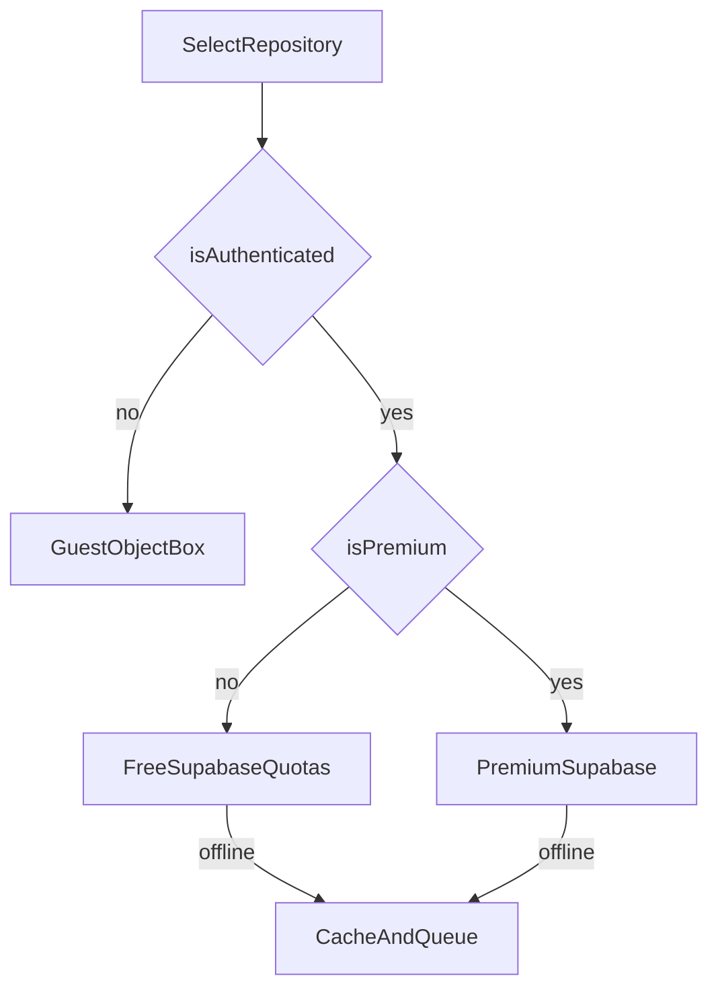

# Sprint 5-6 Collections Architecture

## Objective

Deliver nested collections with robust local/cloud repository selection, safe ownership enforcement, and stable navigation for deep collection trees.

## Functional acceptance

- Root and nested collections CRUD is supported.
- Breadcrumb navigation is accurate for deep nesting.
- Reorder persists using `FLOAT8` **positions**; production behavior should use **fractional indexing** between neighbors (see below), not raw list indices where possible.
- Pin/archive behavior is deterministic and consistent in local and cloud modes.
- Repository selection follows state machine inputs:
  - `isAuthenticated`
  - `isPremium` (subscription entitlements)
  - `hasMigratedToCloud` (app flag)
  - `isOnline` (network reachability — must be wired to a real provider long-term)
  - Write gating: e.g. `isSubscriptionActive` for cloud writes when using read-only decorator pattern.

## Domain contract

Align app entities/mappers with Postgres `lv_collections` (see [Schema checklist](Sprint_5_6_Collections_Schema_and_RLS_Checklist.md)). Logical fields:

| Concern | Postgres column | Notes |
| ------- | ---------------- | ----- |
| Primary key | `id` | UUID |
| Owner | `owner_id` | `auth.users` FK |
| Parent folder | `parent_id` | Nullable; self-FK to `lv_collections` |
| Title | `title` | Not `name` |
| Category label | `category` | User-facing string; not a separate taxonomy table in Sprint 5-6 |
| Cover color | `color_hex` | Hex string |
| Catalog icon | `icon_name` | Catalog key or emoji string persisted as text |
| Sort key | `position` | `FLOAT8` |
| Pin / archive | `is_pinned`, `is_archived` | |
| Soft delete | `is_deleted`, `deleted_at` | If used app-wide |
| Counts | `url_count`, `child_count` | Maintain via triggers where possible |
| Timestamps | `created_at`, `updated_at` | |

App-layer naming may use `colorHex`, `iconName`, `itemCount` mapping to `url_count` for URLs-per-collection — keep mapping explicit in mappers.

## Data sources

- **Local:** ObjectBox (**guest** authoritative; **authenticated** offline cache + queue).
- **Cloud:** Supabase `public.lv_collections` and `public.lv_urls` for **all signed-in users** (free with quotas, premium with higher limits).

**Canonical state machine:** [Data_Persistence_State_Machine.md](../../04_DATA_AND_MIGRATION/Data_Persistence_State_Machine.md) v2+ · **ADR-0002** (free account = cloud + quotas).

## Repository selector behavior

**Intended decision table** (collections and items should share the same rules):

| Condition | Repository | Writes |
| --------- | ---------- | ------ |
| Guest (`!isAuthenticated`) | Local ObjectBox | Full local |
| Authenticated + **not** premium + online | Supabase `lv_*` + cache | Allowed within **quotas** + Day Pass rules |
| Authenticated + **not** premium + offline | Cache + queue | Queued or policy-blocked |
| Authenticated + premium + online | Supabase `lv_*` + cache | Full (no quota wall); subscription lapsed → read-only or policy |
| Authenticated + premium + offline | Cache + queue | Queued sync |

**Implementation note:** Repository selector targets ADR-0002 (free + online → Supabase; premium + migration; offline → local). Refactor further when offline **write queue** ships.

## Sorting precedence

Default collection ordering within a **parent scope** (same `parent_id`):

1. Active before archived: `is_archived` ascending (false first).
2. Pinned first: `is_pinned` descending (true first).
3. `position` ascending.
4. `updated_at` descending (tie-break).

Archived collections may be hidden from default home/root or shown in a dedicated “Archived” filter — product choice; document in UI flows.

## Fractional indexing for reorder

When user drags item at index `i` to new index among `n` siblings ordered by `position`:

1. Load ordered siblings: `p[0] … p[n-1]` by current `position`.
2. After logical reorder, let `prev = position before slot`, `next = position after slot` (null if at ends).
3. New position:
   - If both null: use `0` or a baseline step.
   - If `prev` null: `next - 1` (or half toward `-inf` if collision risk).
   - If `next` null: `prev + 1`
   - Else: `(prev + next) / 2`
4. If `(prev, next)` interval is too small for float stability, **rebalance**: reassign positions `0, 1, 2, …` or exponential spacing, batch update siblings.

Apply the same pattern to `lv_urls` within a collection when URL reorder ships in Sprint 7–8.

## Safety rules

### Parent assignment / cycles

Before persisting `parent_id`:

- Reject `parent_id == id`.
- Walk from proposed parent up by `parent_id` until null; if any step equals `id`, reject (would create a cycle).
- Reject parent belonging to another owner (RLS should block; app should pre-validate for UX).

### Delete cascade

- **Postgres:** `ON DELETE CASCADE` on `parent_id` and `collection_id` ensures subtree and URLs remove when a row is hard-deleted.
- **Local:** Repository must delete child collections and items under a removed subtree, or soft-delete consistently if soft-delete is the app standard.

### Cross-tier consistency

After migration to cloud, ensure local cache invalidation or single-writer rules to avoid split-brain edits (deferred to full sync sprint if out of scope).

## Custom categories and icons (product scope)

- **Categories:** Stored as plain `category` text on `lv_collections`. Users can pick from presets or type a custom label; no `lv_categories` table required for Sprint 5-6.
- **Icons:** **Catalog-only:** store chosen glyph or key in `icon_name`. Avoid fetching arbitrary URLs for icons in this sprint (security, offline, consistency). A future sprint can add Material icon keys or bundled asset IDs.
