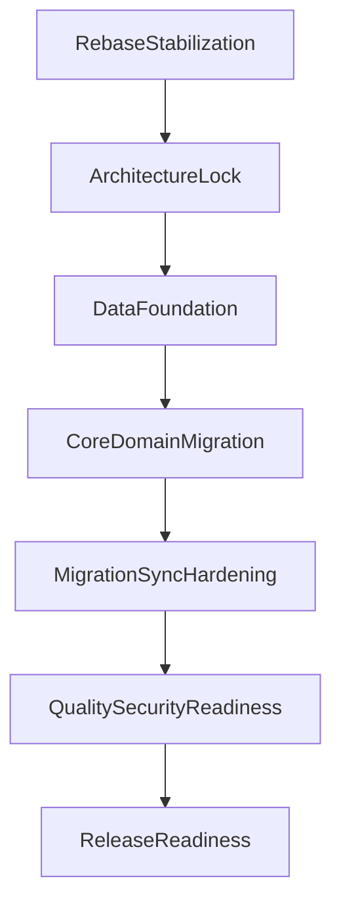

# Milestones, Dependencies, and Readiness Gates

Version: 1.0  
Last Updated: 2026-03-23  
Status: Active  
Owner: Engineering Leadership + Product  
Depends On: `docs/00_PROJECT_OVERVIEW/Master_Project_Plan.md`, `docs/03_ARCHITECTURE/Technical_Architecture.md`

---

## Purpose

Provide an execution control framework with milestone outputs, dependency order, and go/no-go gates.

---

## Milestones

| Milestone | Goal | Key Deliverables |
|---|---|---|
| M0 | Rebase stabilization | single canonical runtime path, baseline build/test pass |
| M1 | Architecture lock | architecture docs approved, ADR baseline approved |
| M2 | Data foundation | Supabase migrations applied, RLS validated, env config hardened |
| M3 | Core domain migration | collections/URLs module behavior implemented to canonical contracts |
| M4 | Migration and sync hardening | premium migration flow + reconciliation + retry behavior validated |
| M5 | Quality/security readiness | testing gates met, security checks complete |
| M6 | Release readiness | staged rollout and rollback playbooks approved |

---

## Dependency Graph

---

## Critical Path Constraints

1. M0 must finish before any module-level migration work.
2. M2 (schema + RLS) is prerequisite for any cloud repository rollout.
3. M4 requires M3 completed and data migration suite implemented.
4. M5 requires stable telemetry for sync and migration failure classes.
5. M6 requires successful beta metrics against release gate thresholds.

---

## Definition of Ready (DoR)

A milestone is ready to start when:

- prerequisites are completed and signed
- owner and reviewers are assigned
- implementation contracts are documented
- test approach is defined
- rollback strategy exists for high-risk changes

---

## Definition of Done (DoD)

A milestone is done when:

- deliverables are complete
- acceptance checks pass
- dependent docs are updated
- unresolved risks are tracked with owners
- explicit sign-off is recorded

---

## Go/No-Go Release Gates

### Gate G1: Architecture Readiness

Criteria:

- no unresolved architecture contradictions
- ADR baseline approved
- runtime entrypoint ambiguity removed

### Gate G2: Data Readiness

Criteria:

- migrations execute cleanly in staging
- RLS policy tests pass for all `lv_*` tables
- drift detection checks pass on seeded dataset

### Gate G3: Quality Readiness

Criteria:

- test suite pass rates meet agreed thresholds
- critical user journeys pass integration tests
- known P0/P1 defects resolved or explicitly waived

### Gate G4: Security Readiness

Criteria:

- secret scanning clean
- no hardcoded production credentials
- account deletion/export paths verified

### Gate G5: Rollout Readiness

Criteria:

- staged rollout plan approved
- rollback playbook validated
- on-call and incident response contacts assigned

---

## Gate Sign-Off Record Template

| Gate | Decision | Date | Approver | Notes |
|---|---|---|---|---|
| G1 | Pending | - | - | - |
| G2 | Pending | - | - | - |
| G3 | Pending | - | - | - |
| G4 | Pending | - | - | - |
| G5 | Pending | - | - | - |

---

## Revision History

| Version | Date | Notes |
|---|---|---|
| 1.0 | 2026-03-23 | Initial governance framework for milestone execution and release gates. |
